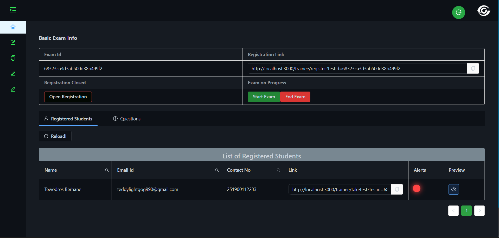

# AI-Based Cheating Detection System for Online Exams 🎓🔍

[](LICENSE)

## Overview
Revolutionizing academic integrity in online exams, this AI-powered system detects cheating through **real-time head movement tracking** and **whisper/murmur detection**. Designed for institutions like Mekelle University, it addresses critical gaps in traditional proctoring tools by analyzing subtle behavioral cues often missed by conventional systems.

---

## Key Features 🚨
- **Multi-Modal Detection**  
  - Head pose estimation & gaze tracking via computer vision  
  - Whisper/murmur detection using audio frequency analysis  
- **Real-Time Alerts**  
  Immediate notifications for suspicious activity during exams  
- **Ethiopian Exam Integration**  
  Optimized for GAT, Exit Exams, and university assessments  
- **Privacy-First Design**  
  Minimal data retention with encrypted streams  

---

## How It Works 🤖
1. **Behavior Baseline**  
   Establishes normal movement/speech patterns during exam setup  
2. **Dual Analysis Streams**  
   - **Video Pipeline**: OpenCV + MediaPipe track facial landmarks  
   - **Audio Pipeline**: Librosa extracts voice features from microphone input  
3. **Anomaly Detection**  
   Machine learning models flag deviations (sudden head turns, low-volume speech)  
4. **Proctor Dashboard**  
   Visualizes alerts with timestamped video/audio snippets  

---

## Technical Stack 💻
| Component          | Technologies                                                                 |
|--------------------|-----------------------------------------------------------------------------|
| **Computer Vision** | OpenCV, MediaPipe, CNN/RNN (TensorFlow/PyTorch)                            |
| **Audio Processing**| Librosa, Spectrogram Analysis, CNNs                                         |
| **Backend**         | Django REST Framework                                                      |
| **Frontend**        | React.js (Examiner Dashboard)                                              |
| **Deployment**      | AWS/Azure GPU instances for real-time inference                            |
| **Datasets**        | Curated from Mendeley cheating behavior dataset + Mozilla Common Voice     |

---

## Demo 🎥
  
*Real-time monitoring interface showing:*  
- Student webcam feeds  
- Audio waveform visualization  
- Flagged event timeline  

---

## Project Significance 🌍
- **Academic Trust**: Protects the value of Ethiopian university degrees  
- **Government Use**: Secures civil service exams and professional certifications  
- **Corporate Ready**: Ensures integrity in bank recruitment math assessments  

---

## Limitations ⚠️
- Requires minimum 720p webcam resolution  
- May struggle with heavy background noise  
- Not a replacement for human judgment - flags require proctor review  

---

## Contributing 🤝
We welcome improvements to:  
- Noise cancellation algorithms  
- Low-light video processing  
- Amharic/Tigrinya whisper detection  

```bash
# Suggested contribution workflow
git clone https://github.com/Tewodros-Berhane/AI-Based-Cheating-Detection-System-for-Online-Exams.git 
git checkout -b feature/audio-enhancements
# Make changes...
git commit -m "Added noise suppression layer"
git push origin feature/audio-enhancements
