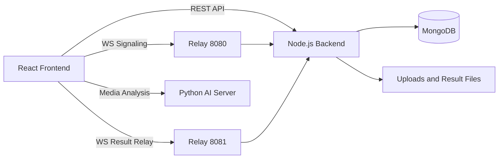

# Exam Shield AI

Exam Shield AI is a production-oriented online examination platform with role-based administration, live proctoring, resilience against session interruption, moderation controls, and post-exam quality analytics.

## Platform Summary

The repository ships four runtime pieces:

- `Frontend`: React 18 single-page application for admin, examiner, and examinee workflows
- `Backend`: Node.js/Express API, exam engine, moderation/reporting logic, and WebSocket relay services
- `AI Server`: Python media-analysis service used by the proctoring pipeline
- `MongoDB`: persistent data store for users, exams, answers, results, events, and analytics

## Core Capabilities

### Admin
- Manage examiner accounts
- Manage course catalog entries
- Review platform-wide dashboard metrics

### Examiner
- Build questions and exams
- Configure security level and entry checks before exam start
- Toggle face-recognition enforcement before exam start
- Open and close registration
- Run live exam sessions
- Monitor examinees in real time
- Apply support settings and moderation actions
- Generate results and review exam-quality analytics

### Examinee
- Register through an exam-specific link
- Receive exam access by email
- Complete pre-entry device checks when required
- Take exams with auto-save and reconnect recovery
- View results and submit feedback after completion

## Key Features

- React 18 + Redux web client with separate admin, examiner, and examinee experiences
- Header-based bearer auth for protected admin/examiner APIs
- Docker Compose deployment for frontend, backend, AI server, and MongoDB
- Live proctoring timeline with severity scoring and examiner acknowledgement/review actions
- Security levels with conditional pre-entry checks
- Session resilience with heartbeat, reconnect handling, grace windows, and local draft buffering
- Examinee support settings and examiner moderation controls
- Result generation with Excel export
- Exam-quality analytics and review queues for completed exams
- Docker regression harness and Cypress smoke coverage for critical flows

## Architecture


```mermaid
flowchart LR
    A[React Frontend] -->|REST API| B[Node.js Backend]
    A -->|WS Signaling| C[Relay 8080]
    A -->|WS Result Relay| D[Relay 8081]
    A -->|Media Analysis| E[Python AI Server]
    B --> F[(MongoDB)]
    B --> G[Uploads and Result Files]
    C --> B
    D --> B
```

## Tech Stack

| Layer | Technologies |
| --- | --- |
| Frontend | React 18, React Router 6, Redux 5, Ant Design 5, lucide-react, Chart.js, Cypress |
| Backend | Node.js 20, Express 5, Mongoose, Passport JWT, Nodemailer, WebSocket relay, ExcelJS |
| AI Server | Python 3.10, aiohttp, aiortc, TensorFlow, PyTorch, librosa |
| Database | MongoDB 7 |
| Deployment | Docker Compose, Nginx, Docker volumes |

## Repository Layout

```text
.
|-- AI Server/
|-- Backend/
|-- Frontend/
|-- docs/
|   |-- DEPLOYMENT_NOTES.md
|   |-- DOCKER_SETUP.md
|   |-- OPERATOR_GUIDE.md
|   `-- explanation.md
|-- scripts/
|   `-- docker-regression.ps1
|-- docker-compose.yml
|-- .env.docker.example
`-- README.md
```

## Quick Start With Docker

### 1. Prepare the environment file

```powershell
Copy-Item .env.docker.example .env.docker
```

Review these values before first run:
- `JWT_SECRET`
- `MAIL_USER`
- `MAIL_PASSWORD`
- `FRONTEND_BASE_URL`
- `REACT_APP_API_BASE_URL`

Important frontend runtime note:
- When using the bundled Nginx frontend, keep `REACT_APP_API_BASE_URL=http://localhost:3000`
- The frontend container reverse-proxies `/api`, `/uploads`, and `/result` to the backend

### 2. Start the stack

```powershell
docker compose --env-file .env.docker up --build -d
```

### 3. Open the app

- Frontend: [http://localhost:3000](http://localhost:3000)
- Backend health: [http://localhost:5001/api/v1/system/health](http://localhost:5001/api/v1/system/health)
- AI server: [http://localhost:5020](http://localhost:5020)

### 4. Stop the stack

```powershell
docker compose --env-file .env.docker down
```

## Default Admin Bootstrap

The backend currently calls `createadmin()` on startup. In a fresh database, the default admin account is created automatically with:

- Email: `admin@gmail.com`
- Password: `admin`

This is development-friendly, not production-safe. Change or remove this behavior before a real deployment.

## Local Development

### Backend

```powershell
cd Backend
npm install
npm start
```

### Frontend

```powershell
cd Frontend
npm install
npm start
```

Suggested local frontend environment:

```env
REACT_APP_API_BASE_URL=http://localhost:5001
REACT_APP_WS_SIGNALING_URL=ws://localhost:8080
REACT_APP_WS_RESULT_URL=ws://localhost:8081
REACT_APP_AI_SERVER_URL=http://localhost:5020
```

### AI Server

```powershell
cd "AI Server"
python -m venv .venv
.\.venv\Scripts\Activate.ps1
pip install -r requirements.txt
python server.py
```

### MongoDB only in Docker

```powershell
docker compose --env-file .env.docker up -d mongo
```

## Environment Groups

### MongoDB
- `MONGO_DB_NAME`
- `MONGO_PORT`

### Backend
- `BACKEND_PORT`
- `JWT_SECRET`
- `MAIL_USER`
- `MAIL_PASSWORD`
- `WS_SIGNALING_PORT`
- `WS_RESULT_PORT`
- `FRONTEND_BASE_URL`
- logging, metrics, alerting, and relay variables

### AI Server
- `AI_SERVER_PORT`
- `AI_ALLOWED_ORIGINS`

### Frontend
- `FRONTEND_PORT`
- `REACT_APP_API_BASE_URL`
- `REACT_APP_WS_SIGNALING_URL`
- `REACT_APP_WS_RESULT_URL`
- `REACT_APP_AI_SERVER_URL`
- STUN/TURN configuration

Use [`.env.docker.example`](.env.docker.example) as the baseline.

## Proctoring, Moderation, and Analytics

### Security levels
Examiners can configure exam entry policy before an exam starts:
- `Light`
- `Standard`
- `Strict`

### Pre-entry checks
Depending on exam policy, the platform can require:
- camera
- microphone
- screen sharing
- fullscreen
- browser readiness
- network checks
- VPN restrictions

### Proctoring event model
Live monitoring records events such as:
- suspicious and cheating AI signals
- no-face, multi-face, and face-mismatch signals
- tab and fullscreen violations
- disconnect/reconnect events
- examiner review actions

### Examinee support settings
Examiners can apply:
- extra time
- accessibility options
- monitoring exceptions where policy permits
- scheduling adjustments

### Moderation controls
Examiners can:
- acknowledge incidents
- confirm or excuse incidents
- warn examinees
- force submit sessions
- reopen sessions
- disqualify results

### Exam-quality analytics
Completed exams expose:
- score distribution
- pass rate
- item difficulty
- discrimination indicators
- low-quality question flags
- review queues for weak questions

## Testing And Regression

### Docker regression harness

```powershell
powershell -ExecutionPolicy Bypass -File scripts\docker-regression.ps1
```

This validates:
- admin login and dashboard
- examiner login and dashboard
- question and exam creation
- registration and resend email
- pre-entry checks by security level
- live exam start/end
- result generation
- exam-quality analytics endpoints

### Frontend smoke tests

```powershell
cd Frontend
npm run smoke
```

### Frontend test runner

```powershell
cd Frontend
npm test
```

## Common Docker Commands

### Rebuild frontend only

```powershell
docker compose --env-file .env.docker up -d --build frontend
```

### Rebuild backend only

```powershell
docker compose --env-file .env.docker up -d --build backend
```

### Tail logs

```powershell
docker compose --env-file .env.docker logs -f frontend backend ai-server mongo
```

### Check service state

```powershell
docker compose --env-file .env.docker ps
```

## Troubleshooting

### Frontend loads but API actions fail
- Confirm `REACT_APP_API_BASE_URL` matches the deployment mode
- In Docker mode, it should normally be `http://localhost:3000`
- Review frontend and backend logs together

### Email delivery fails
- Verify `MAIL_USER` and `MAIL_PASSWORD`
- Use a valid app password if Gmail SMTP is configured
- Rebuild the backend after mail environment changes

### Live preview or real-time monitoring is unstable
- Confirm WebSocket ports are available
- Confirm STUN/TURN settings if testing across restrictive networks
- Check browser permissions for camera, microphone, and screen sharing

### Exam-quality tabs show little or no data
- Ensure the exam is completed
- Ensure results were generated
- Expect limited analytics for very small cohorts

## Documentation

- [Docker setup guide](docs/DOCKER_SETUP.md)
- [Deployment notes](docs/DEPLOYMENT_NOTES.md)
- [Operator guide for admin and examiner users](docs/OPERATOR_GUIDE.md)
- [Live alert scoring and acknowledgement behavior](docs/explanation.md)

## License

See [LICENSE](LICENSE).
