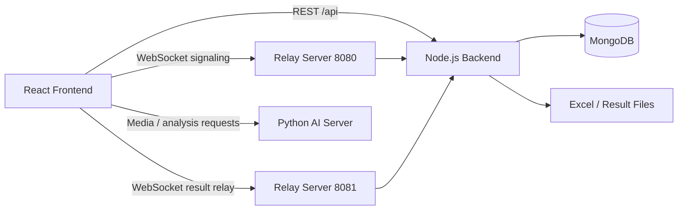

# Exam Shield AI

Exam Shield AI is a full-stack online examination platform with live proctoring, configurable integrity policies, resilient candidate sessions, moderation tooling, and post-exam psychometric analytics.

This repository contains four runtime pieces:
- `Frontend`: React 18 single-page application for admin, examiner, and examinee flows
- `Backend`: Node.js/Express API, exam engine, reporting, moderation, and websocket relay services
- `AI Server`: Python-based real-time media analysis service used by the proctoring pipeline
- `MongoDB`: persistent store for users, exams, submissions, proctoring events, and analytics

## What The System Covers

### Admin workflows
- Manage courses and examiner accounts
- Access platform-level dashboards
- Monitor high-level operational activity

### Examiner workflows
- Create and publish exams
- Configure integrity mode and entry checks before start
- Open and close registration
- Start and end live exam sessions
- Review candidates in Live Exam Operations
- Apply accommodations and moderation actions
- Generate results and inspect psychometric statistics

### Examinee workflows
- Register through the exam link delivered by email
- Complete preflight checks before entry when required
- Take timed exams with auto-save and reconnect recovery
- Submit feedback after the exam
- View results when published

## Key Product Capabilities

- Role-based web application for admin, examiner, and examinee users
- Exam creation with question bank selection and result generation
- Integrity modes with configurable preflight checks
- Optional face-recognition enforcement before exam start
- Live proctoring event timeline with severity scoring
- Session resilience with reconnect handling, grace periods, and auto-save
- Candidate accommodations and examiner moderation actions
- Psychometric analytics for completed exams
- Docker-based single-instance deployment
- Smoke test coverage for core login, registration, exam, and result flows

## Architecture


```mermaid
flowchart LR
    A[React Frontend] -->|REST /api| B[Node.js Backend]
    A -->|WebSocket signaling| C[Relay Server 8080]
    A -->|WebSocket result relay| D[Relay Server 8081]
    A -->|Media / analysis requests| E[Python AI Server]
    B --> F[(MongoDB)]
    C --> B
    D --> B
    B --> G[Excel / Result Files]
```

## Tech Stack

| Layer | Technologies |
| --- | --- |
| Frontend | React 18, React Router 6, Redux 5, Ant Design 5, lucide-react, Chart.js, Cypress |
| Backend | Node.js, Express 5, Mongoose 9, Passport JWT, Nodemailer, WebSocket relay, ExcelJS |
| AI Server | Python 3.10, aiortc, aiohttp, TensorFlow 2.15, PyTorch 2.5, librosa |
| Database | MongoDB 7 |
| Deployment | Docker Compose, Nginx frontend container, persistent Docker volumes |

## Repository Layout

```text
.
|-- AI Server/               Python analysis service
|-- Backend/                 API, websocket relays, reporting, moderation, analytics
|-- Frontend/                React application and Cypress smoke tests
|-- docs/
|   |-- DOCKER_SETUP.md      Docker Desktop and compose guide
|   `-- explanation.md       Proctoring severity and acknowledgement logic
|-- docker-compose.yml       Full local deployment stack
|-- .env.docker.example      Example environment file for Docker runs
`-- README.md
```

## Prerequisites

### Recommended path: Docker
- Docker Desktop
- Docker Compose v2

### For local non-Docker development
- Node.js 20+
- npm 10+
- Python 3.10
- MongoDB 7
- FFmpeg and audio/video system libraries required by the AI server

## Quick Start With Docker

### 1. Create the environment file
Copy the example file and fill in the required values:

```powershell
Copy-Item .env.docker.example .env.docker
```

Required values to review before first run:
- `JWT_SECRET`
- `MAIL_USER`
- `MAIL_PASSWORD`
- `FRONTEND_BASE_URL`
- `REACT_APP_API_BASE_URL`

Important Docker note:
- When using the bundled Nginx frontend, keep `REACT_APP_API_BASE_URL=http://localhost:3000`
- The frontend container reverse-proxies `/api`, `/uploads`, and `/result` to the backend

### 2. Build and start the stack

```powershell
docker compose --env-file .env.docker up --build -d
```

### 3. Open the application
- Frontend: [http://localhost:3000](http://localhost:3000)
- Backend API health: [http://localhost:5001/api/v1/system/health](http://localhost:5001/api/v1/system/health)
- AI server: [http://localhost:5020](http://localhost:5020)

### 4. Stop the stack

```powershell
docker compose --env-file .env.docker down
```

### 5. Persisted data
Docker volumes used by the stack:
- `mongo_data`
- `backend_uploads`
- `backend_results`

For detailed Docker setup, troubleshooting, and MongoDB notes, see [docs/DOCKER_SETUP.md](docs/DOCKER_SETUP.md).

## Local Development Without Docker

### Backend

```powershell
cd Backend
npm install
npm start
```

The backend listens on `PORT` and exposes:
- REST API on `5001` by default
- signaling relay on `8080`
- result relay on `8081`

### Frontend

```powershell
cd Frontend
npm install
npm start
```

Suggested local frontend environment:

```env
REACT_APP_API_BASE_URL=http://localhost:5001
REACT_APP_WS_SIGNALING_URL=ws://localhost:8080
REACT_APP_WS_RESULT_URL=ws://localhost:8081
REACT_APP_AI_SERVER_URL=http://localhost:5020
```

### AI Server

```powershell
cd "AI Server"
python -m venv .venv
.\.venv\Scripts\Activate.ps1
pip install -r requirements.txt
python server.py
```

### MongoDB
Run MongoDB locally on the configured port or use Docker only for MongoDB:

```powershell
docker compose --env-file .env.docker up -d mongo
```

## Environment Configuration

The project is environment-driven. The Docker example groups settings into four areas:

### MongoDB
- `MONGO_DB_NAME`
- `MONGO_PORT`

### Backend
- `BACKEND_PORT`
- `JWT_SECRET`
- `MAIL_USER`
- `MAIL_PASSWORD`
- `WS_SIGNALING_PORT`
- `WS_RESULT_PORT`
- `FRONTEND_BASE_URL`
- logging, metrics, relay, and failure-alert settings

### AI Server
- `AI_SERVER_PORT`
- `AI_ALLOWED_ORIGINS`

### Frontend runtime targets
- `FRONTEND_PORT`
- `REACT_APP_API_BASE_URL`
- `REACT_APP_WS_SIGNALING_URL`
- `REACT_APP_WS_RESULT_URL`
- `REACT_APP_AI_SERVER_URL`
- STUN/TURN variables

Use [`.env.docker.example`](.env.docker.example) as the source of truth for Docker deployments.

## Authentication And Access

### Admin / examiner login
- Trainer and admin access is protected through backend-authenticated routes
- Frontend session state is driven by authenticated API responses

### Examinee access
- Examinees enter through exam-specific registration and exam links
- Registration email delivery depends on valid SMTP credentials in `.env.docker`

### Admin bootstrap
If you need to seed or update an admin account manually:

```powershell
cd Backend
$env:ADMIN_EMAIL='admin@example.com'
$env:ADMIN_PASSWORD='change-me'
$env:ADMIN_CONTACT='251900000000'
npm run seed:admin
```

## Proctoring And Integrity Features

### Integrity modes
The examiner can define entry policy before an exam starts. The current platform supports:
- light entry rules
- standard entry rules
- strict entry rules

### Preflight checks
Depending on exam configuration, candidates may need to verify:
- camera
- microphone
- screen sharing
- browser/environment readiness
- network readiness
- VPN restrictions when enabled by the exam policy

### Proctoring event model
The platform records live events such as:
- AI suspicious and cheating signals
- no-face / multi-face / face mismatch events
- tab switches and fullscreen violations
- connection interruptions and restores
- examiner acknowledgements and moderation actions

Severity snapshots are computed from these events and shown in Live Exam Operations.

A deeper explanation of scoring, event bands, and acknowledgement behavior is in [docs/explanation.md](docs/explanation.md).

## Session Resilience

The examinee runtime supports:
- answer auto-save
- reconnect recovery
- local draft buffering during interruptions
- grace-period handling for temporary disconnects
- server-authoritative end-of-exam behavior

This reduces candidate disruption during refreshes and short network instability.

## Accommodations And Moderation

Examiner-side controls include:
- extra time
- screen-share, microphone, face-verification, and fullscreen exemptions
- trainer notes and warnings
- force submit
- reopen session
- disqualification and review outcomes

These actions are audit-aware and tied to candidate session history.

## Results And Analytics

### Result generation
The backend can:
- score completed exams
- generate result views
- export Excel outputs
- publish post-exam summaries

### Psychometric analytics
Completed exams expose analytics such as:
- score distribution
- pass rate
- item difficulty
- discrimination indicators
- distractor quality signals
- flagged-question review queues

These are available in the examiner statistics experience after results exist for a completed exam.

## Testing

### Frontend smoke tests
The frontend includes Cypress smoke coverage for:
- login
- trainee registration
- exam start / end
- result-generation flow

Run smoke tests with:

```powershell
cd Frontend
npm run smoke
```

### Frontend unit/test runner

```powershell
cd Frontend
npm test
```

### Backend
There is no comprehensive automated backend test suite checked in yet. Current validation is primarily smoke-flow and runtime verification.

## Common Operational Commands

### Rebuild frontend only

```powershell
docker compose --env-file .env.docker up -d --build frontend
```

### Rebuild backend only

```powershell
docker compose --env-file .env.docker up -d --build backend
```

### Tail logs

```powershell
docker compose --env-file .env.docker logs -f frontend backend ai-server mongo
```

### Check running containers

```powershell
docker compose --env-file .env.docker ps
```

## Troubleshooting

### Frontend loads but login or API actions do not work
- Confirm `REACT_APP_API_BASE_URL` matches the deployment mode
- In Docker mode, it should normally be `http://localhost:3000`
- Check frontend and backend container logs together

### Emails are not being sent
- Verify `MAIL_USER` and `MAIL_PASSWORD`
- Use a valid Gmail app password if Gmail SMTP is configured
- Rebuild the backend after changing mail environment variables

### Statistics tab returns no data
- Confirm the exam is completed and has result data
- Confirm the backend is running with the latest psychometric routes

### Face recognition build warnings
The current frontend build still emits warnings from the `face-api.js` dependency source maps. They do not currently block the production build, but they should be cleaned in a future maintenance pass.

## Documentation

Additional documentation kept in the repository:
- [docs/DOCKER_SETUP.md](docs/DOCKER_SETUP.md)
- [docs/explanation.md](docs/explanation.md)

## License

This repository is distributed under the terms described in [LICENSE](LICENSE).
