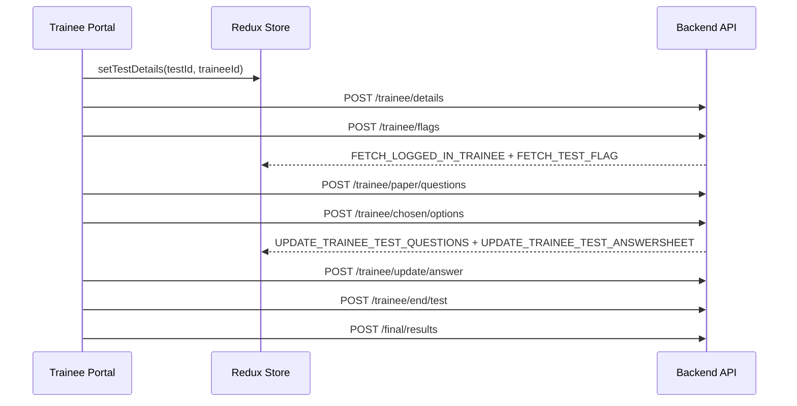

# Modern Era Redesign: Exam Portal

## Phase 1: Deep-Dive Audit

### 1) Tech Stack
- Framework: React (`react-scripts` SPA)
- Routing: `react-router-dom` (`/`, `/user/:options`, `/trainee/register`, `/trainee/taketest`)
- State management: Redux (`redux`, `react-redux`, `redux-thunk`, `redux-logger`)
- UI library: Ant Design (`antd`) with legacy compatibility layer (`@ant-design/compatible`)
- Styling method: global CSS + component-scoped CSS files (no CSS modules)
- Networking: Axios wrappers (`Post`, `SecurePost`, `SecureGet`) in [`Frontend/src/services/axiosCall.js`](c:\Users\tewod\OneDrive\Desktop\AI-Based-Cheating-Detection-System-for-Online-Exams\Frontend\src\services\axiosCall.js)

### 2) Visual Identity (Before Redesign)
- Color direction: dark GitHub-like palette mixed with legacy grays.
  - Primary dark: `#0d1117`, `#161b22`
  - Accent blue: `#58a6ff`
  - Accent green: `#238636`, `#2ea043`
  - Texts: `#c9d1d9`, `#8b949e`, occasional `#ffffff`
- Typography: mixed defaults and Google fonts (`Orbitron`, `Open Sans`, `Montserrat`) without a single tokenized system.
- Logo usage:
  - Login page local image (`main.jpg`)
  - Dashboard header local image (`main.jpg`)
  - Trainee panel icon (`user.png`)

### 3) The Backbone (Routing, API, Data Flow)

#### Routing map
```mermaid
flowchart TD
  A[/] --> B[Homepage/Login]
  C[/home] --> B
  D[/user] --> E[/user/home]
  E --> F[Dashboard Shell]
  G[/user/:options] --> F
  H[/trainee/register] --> I[Trainee Registration]
  J[/trainee/taketest] --> K[Trainee Portal]
```

#### Exam data flow (trainee session)


#### Integration points
- REST endpoints centralized in [`Frontend/src/services/Apis.js`](c:\Users\tewod\OneDrive\Desktop\AI-Based-Cheating-Detection-System-for-Online-Exams\Frontend\src\services\Apis.js)
- Auth headers through `Authorization: Bearer <token>`
- WebSocket integration:
  - Signaling URL (`WS_SIGNALING_URL`)
  - Result stream URL (`WS_RESULT_URL`)

### 4) Running Instructions

#### Prerequisites
- Node.js 18+ recommended
- npm
- MongoDB + Backend API + AI server for full workflow

#### Frontend
```bash
cd Frontend
npm install
npm start
```

#### Backend
```bash
cd Backend
npm install
npm start
```

#### AI Server
```bash
cd "AI Server"
# install python deps from existing environment/requirements
python server.py
```

#### Production build
```bash
cd Frontend
npm run build
```

## Phase 2: Research & Modernization Strategy

### Competitive Pattern Review (Duolingo English Test / Pearson VUE / modern LMS)

Observed modern patterns that were applied:
- Focus Mode:
  - Single dominant question surface
  - Persistent but minimal timing + navigator panel
  - Removal of decorative clutter during active test
- Accessibility:
  - High contrast text/background pairings
  - Larger hit targets for question navigation and answer options
  - Clear state labels (`Answered`, `Flagged`, `Pending`)
- Micro-interactions:
  - Soft hover states on nav tiles/cards
  - Status chips for permission and progress states
  - Consistent semantic colors for success/warning/danger feedback

### Proposed Core Design System
- Color system:
  - Deep slate backgrounds (`#070d19`, `#101a2e`)
  - Accent blue (`#3b82f6`, `#1d4ed8`)
  - Success green (`#16a34a`)
  - Warning amber (`#f59e0b`)
  - Danger red (`#dc2626`)
- Typography:
  - Headings: `Sora`
  - Body/UI: `Manrope`
- Component language:
  - Rounded corners (8/12/18/22 px tiers)
  - Layered glass surfaces with subtle blur
  - Soft borders + low-noise shadows
  - Dense but readable cards and control panels

## Phase 3: Total Transformation (Execution)

### What changed in code

#### UI Backbone and theming
- Added global design tokens and typography in [`Frontend/src/App.css`](c:\Users\tewod\OneDrive\Desktop\AI-Based-Cheating-Detection-System-for-Online-Exams\Frontend\src\App.css)
- Added new brand mark asset:
  - [`Frontend/src/assets/examshield-mark.svg`](c:\Users\tewod\OneDrive\Desktop\AI-Based-Cheating-Detection-System-for-Online-Exams\Frontend\src\assets\examshield-mark.svg)

#### Login and onboarding redesign
- Rebuilt homepage split-layout and message architecture:
  - [`Frontend/src/components/basic/homepage/homepage.js`](c:\Users\tewod\OneDrive\Desktop\AI-Based-Cheating-Detection-System-for-Online-Exams\Frontend\src\components\basic\homepage\homepage.js)
  - [`Frontend/src/components/basic/homepage/homepage.css`](c:\Users\tewod\OneDrive\Desktop\AI-Based-Cheating-Detection-System-for-Online-Exams\Frontend\src\components\basic\homepage\homepage.css)
- Redesigned login card and copy:
  - [`Frontend/src/components/basic/login/login.js`](c:\Users\tewod\OneDrive\Desktop\AI-Based-Cheating-Detection-System-for-Online-Exams\Frontend\src\components\basic\login\login.js)
  - [`Frontend/src/components/basic/login/login.css`](c:\Users\tewod\OneDrive\Desktop\AI-Based-Cheating-Detection-System-for-Online-Exams\Frontend\src\components\basic\login\login.css)

#### Dashboard redesign
- Refreshed sidebar/header/content shell:
  - [`Frontend/src/components/dashboard/backbone.js`](c:\Users\tewod\OneDrive\Desktop\AI-Based-Cheating-Detection-System-for-Online-Exams\Frontend\src\components\dashboard\backbone.js)
  - [`Frontend/src/components/dashboard/backbone.css`](c:\Users\tewod\OneDrive\Desktop\AI-Based-Cheating-Detection-System-for-Online-Exams\Frontend\src\components\dashboard\backbone.css)
- Refreshed dashboard overview cards/tables/copy:
  - [`Frontend/src/components/dashboard/welcome.js`](c:\Users\tewod\OneDrive\Desktop\AI-Based-Cheating-Detection-System-for-Online-Exams\Frontend\src\components\dashboard\welcome.js)
  - [`Frontend/src/components/dashboard/welcome.css`](c:\Users\tewod\OneDrive\Desktop\AI-Based-Cheating-Detection-System-for-Online-Exams\Frontend\src\components\dashboard\welcome.css)

#### Testing room redesign (trainee portal)
- Rewritten exam readiness experience:
  - [`Frontend/src/components/trainee/examPortal/instruction.js`](c:\Users\tewod\OneDrive\Desktop\AI-Based-Cheating-Detection-System-for-Online-Exams\Frontend\src\components\trainee\examPortal\instruction.js)
- Modernized exam layout and side panel:
  - [`Frontend/src/components/trainee/examPortal/testBoard.js`](c:\Users\tewod\OneDrive\Desktop\AI-Based-Cheating-Detection-System-for-Online-Exams\Frontend\src\components\trainee\examPortal\testBoard.js)
  - [`Frontend/src/components/trainee/examPortal/sidepanel.js`](c:\Users\tewod\OneDrive\Desktop\AI-Based-Cheating-Detection-System-for-Online-Exams\Frontend\src\components\trainee\examPortal\sidepanel.js)
  - [`Frontend/src/components/trainee/examPortal/operations.js`](c:\Users\tewod\OneDrive\Desktop\AI-Based-Cheating-Detection-System-for-Online-Exams\Frontend\src\components\trainee\examPortal\operations.js)
  - [`Frontend/src/components/trainee/examPortal/clock.js`](c:\Users\tewod\OneDrive\Desktop\AI-Based-Cheating-Detection-System-for-Online-Exams\Frontend\src\components\trainee\examPortal\clock.js)
  - [`Frontend/src/components/trainee/examPortal/question.js`](c:\Users\tewod\OneDrive\Desktop\AI-Based-Cheating-Detection-System-for-Online-Exams\Frontend\src\components\trainee\examPortal\question.js)
  - [`Frontend/src/components/trainee/examPortal/singleQuestion.js`](c:\Users\tewod\OneDrive\Desktop\AI-Based-Cheating-Detection-System-for-Online-Exams\Frontend\src\components\trainee\examPortal\singleQuestion.js)
  - [`Frontend/src/components/trainee/examPortal/singleQuestion.css`](c:\Users\tewod\OneDrive\Desktop\AI-Based-Cheating-Detection-System-for-Online-Exams\Frontend\src\components\trainee\examPortal\singleQuestion.css)
  - [`Frontend/src/components/trainee/examPortal/portal.css`](c:\Users\tewod\OneDrive\Desktop\AI-Based-Cheating-Detection-System-for-Online-Exams\Frontend\src\components\trainee\examPortal\portal.css)
  - [`Frontend/src/components/trainee/examPortal/user.js`](c:\Users\tewod\OneDrive\Desktop\AI-Based-Cheating-Detection-System-for-Online-Exams\Frontend\src\components\trainee\examPortal\user.js)

#### Results redesign
- New result summary and table presentation:
  - [`Frontend/src/components/trainee/answersheet/answer.js`](c:\Users\tewod\OneDrive\Desktop\AI-Based-Cheating-Detection-System-for-Online-Exams\Frontend\src\components\trainee\answersheet\answer.js)
  - [`Frontend/src/components/trainee/answersheet/answer.css`](c:\Users\tewod\OneDrive\Desktop\AI-Based-Cheating-Detection-System-for-Online-Exams\Frontend\src\components\trainee\answersheet\answer.css)

## Old vs New Architecture Summary

| Area | Old | New |
|---|---|---|
| UI language | Mixed legacy styles, inconsistent spacing/typography | Token-driven design system with consistent spacing, radius, color roles |
| Login | Isolated card on plain background | Split-screen hero + branded secure access card |
| Dashboard shell | Utility-like sidebar and fixed header, limited context | Branded operations shell with contextual page title and user meta |
| Exam room | Functional but visually dense with low hierarchy | Focus-mode layout with clear hierarchy, progress card, cleaner navigator |
| Results | Basic table-first layout | Candidate metadata + summary metrics + improved review table |
| Visual branding | Multiple image-based logos | Single reusable SVG brand mark and consistent branding |

## Functional Integrity Notes
- Core APIs, Redux actions, exam timing, answer updates, end-test flows, and result retrieval remain intact.
- UI copy and presentation were modernized without changing grading/timing logic.
