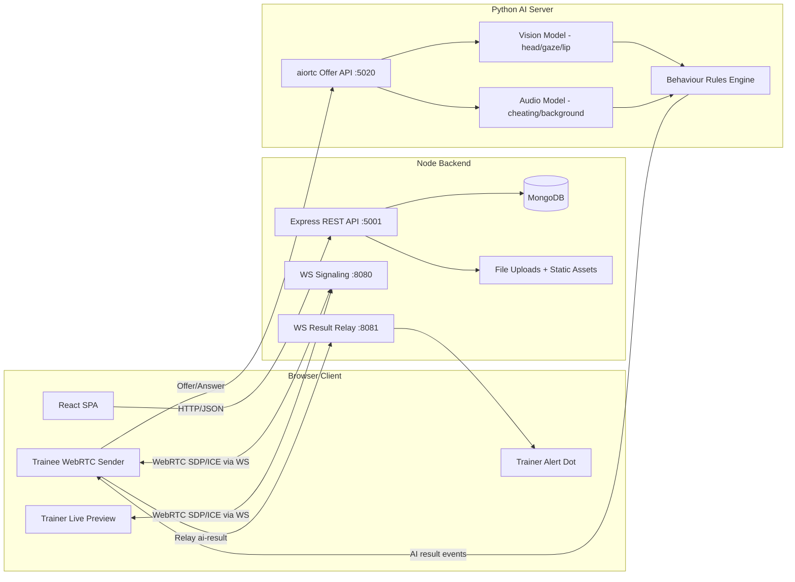
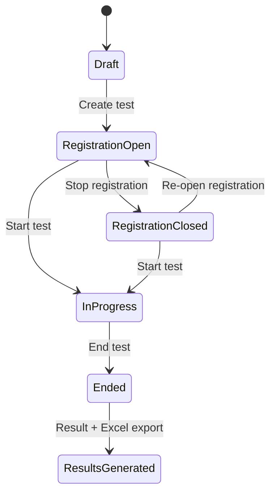
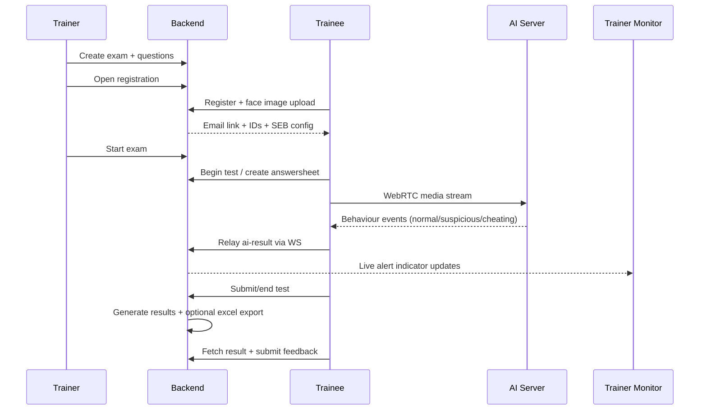

# AI-Based Cheating Detection System: Repository Overview

This document summarizes a full codebase review from three perspectives:

- Software Architect
- Software Developer
- Product Manager

Scope covered: `Frontend`, `Backend`, and `AI Server` plus shared docs/config/assets.

## 1. Executive Summary

The repository implements a complete online-exam platform with role-based workflows (Admin, Trainer, Trainee), objective test authoring/delivery, and real-time proctoring support via WebRTC + AI inference.

High-level assessment:

- Strong functional breadth: exam lifecycle, registration, delivery, scoring, export, dashboard, and live monitoring.
- Practical architecture: React SPA + Express API + MongoDB + Python AI inference service.
- Main risks are operational and maintainability related: hardcoded/local endpoints, missing contract consistency in a few places, outdated frontend stack, and limited automated testing.

## 2. Repository Snapshot

Core runtime areas:

- `Frontend/`: React 16 + Redux + Ant Design v3 UI app
- `Backend/`: Express + Mongoose API, auth, exam domain logic, file upload, ws relay
- `AI Server/`: `aiohttp` + `aiortc`, PyTorch head/gaze/lip model, TensorFlow audio model

Observed file mix (selected):

- JavaScript-heavy codebase (`.js` dominant)
- Python AI service + bundled model artifacts (`.pt`, `.h5`)
- Built frontend assets committed under `Frontend/build` and `Backend/public`

## 3. Software Architect Perspective

### 3.1 Current System Architecture

### 3.2 Exam Lifecycle State Model

`TestPaper` encodes state using booleans (`isRegistrationavailable`, `testbegins`, `testconducted`, `isResultgenerated`).

### 3.3 Architectural Strengths

- Clear service separation by runtime concern (UI/API/AI inference).
- Role-oriented data model aligns with real exam operations.
- Real-time channel separation (`8080` signaling, `8081` result relay) simplifies mental model.
- Good baseline use of Mongo references for exam, question, answer, result relationships.

### 3.4 Scalability and Reliability Risks

- WebSocket client registries are in-process memory maps; horizontal scaling will break cross-instance routing without shared broker/session routing.
- AI inference is per-frame/per-chunk in a single app process; throughput is limited and likely CPU/GPU bound.
- Local filesystem usage for uploads/results is not cloud/distributed safe.
- Multiple hardcoded localhost endpoints prevent environment portability.
- Query-string JWT token pattern is insecure for production deployment and leaks via logs/history.

### 3.5 Architecture Priorities

1. Externalize config and secrets (`.env`, secret manager).
2. Move websocket routing/state to shared infra (Redis pub/sub or dedicated signaling tier).
3. Introduce job queue/event bus for AI inference and durable alert pipelines.
4. Replace boolean test-state flags with explicit finite-state transitions + invariants.
5. Add centralized observability (structured logs, correlation IDs, basic metrics).

## 4. Software Developer Perspective

### 4.1 Code Organization

- Backend pattern: `routes -> services -> models/schemas`.
- Frontend pattern: role-based components + Redux slices (`admin`, `trainer`, `conduct`, `trainee`).
- AI server pattern: media consumers + model wrappers + rule-based fusion.

This structure is understandable and reasonably modular for a small team.

### 4.2 Maintainability/Correctness Findings

| Severity | Area | Finding | Impact |
|---|---|---|---|
| High | Frontend Auth | `loginAction.wakeUp` calls `auth.wakeUp` (method not implemented in `AuthServices`) | Broken silent-session restore path |
| High | Trainee Flow | `traineeAction` dispatches `invalidUrl` but reducer expects `INVALID_TEST_URL` | Invalid URL handling fails silently |
| High | API Contract | `FETCH_TRAINEE_BY_TRAINEEID` and `FETCH_TEST_BY_EXAMID` are used but missing in `services/Apis.js` | Exam ID/Student ID form path can fail |
| High | Security | JWT accepted via URL query (`Token`) | Token leakage risk in logs/history/proxies |
| Medium | Backend Data | `answers.questionid` stored as string, not object ref | Weak referential integrity and query ergonomics |
| Medium | Backend Logic | `findByIdAndUpdate` used with filter object in timeout path | Potential failed completion update |
| Medium | Frontend RTC | Duplicate websocket connections and duplicate end-test logic in `clock` and `sidepanel` | Race conditions, double sends, harder debugging |
| Medium | React Lifecycle | Multiple `componentWillMount` usages | Deprecated lifecycle and migration friction |
| Medium | Operations | Hardcoded localhost URLs (`5001`, `5020`, `8080`, `8081`) spread in components | Fragile deployment and env drift |
| Low | Repo Hygiene | Built assets, caches, and model binaries committed | Larger repo, slower CI/onboarding |
| Low | Testing | Minimal test coverage (`App.test.js` baseline only) | Regression risk |

### 4.3 Engineering Positives

- Domain-heavy logic (scoring, answer sheet generation, feedback, dashboards) is implemented and wired end-to-end.
- UI is segmented by personas, which improves discoverability.
- Reusable axios wrapper and API constant file already exist (good base for cleanup).

### 4.4 Developer-Focused Recommendations

1. Enforce typed API contracts (OpenAPI + generated client or at least shared constant validation).
2. Consolidate trainee real-time session control into one orchestrator component.
3. Add service-level unit tests for scoring/result generation and test lifecycle.
4. Upgrade frontend baseline (React/AntD/toolchain) in controlled phases.
5. Add lint + format + pre-commit hooks and CI checks.

## 5. Product Manager Perspective

### 5.1 Feature Coverage by Persona

- **Admin**: manage examiners, manage courses, dashboard overview.
- **Trainer/Examiner**: create questions, create exams, control registration/start/end, monitor candidates, view stats/feedback/export.
- **Trainee/Student**: register, receive exam link, take exam, submit answers, receive score + feedback form.

### 5.2 End-to-End Workflow

### 5.3 Product Risks and UX Gaps

- ID model is confusing (`examID`, `traineeID`, Mongo `_id`) and exposed across UI/email flow.
- Proctor alerts are color-only; limited explainability for decision review.
- Hard dependency on local services/ports increases setup friction for institutional rollout.
- Security/compliance messaging and consent controls are minimal for biometric/audio monitoring contexts.

### 5.4 Business Alignment

The product strongly aligns with integrity-focused online exam operations and provides practical differentiators (real-time alerting, exam lifecycle management, result analytics). To align with institutional procurement, next steps should prioritize reliability, auditability, and privacy controls over net-new features.

### 5.5 PM Questions to Resolve

1. What is the official source of truth for candidate identity during exam (`traineeID` vs `_id`)?
2. Should suspicious/cheating decisions be explainable/auditable per event?
3. What retention/deletion policy is required for face images, audio-derived artifacts, and monitoring logs?
4. Is SEB mandatory for all deployments, and how will password/config rotation be managed?
5. What are target concurrency numbers (simultaneous candidates) for v1 institutional rollout?

## 6. Recommended Roadmap

### Phase 1: Stabilize Core (Short Term)

- Fix API contract mismatches and reducer/action inconsistencies.
- Unify end-test and websocket logic for trainee session.
- Move all ports/URLs/secrets to environment config.
- Add smoke tests for login, registration, exam start/end, result generation.

### Phase 2: Harden for Production (Mid Term)

- Replace query-token auth with header-based bearer tokens.
- Add centralized logging/metrics and failure alerts.
- Introduce scalable signaling/result routing architecture.
- Define explicit exam state machine constraints.

### Phase 3: Product Maturity (Longer Term)

- Add proctor alert evidence timeline and review tools.
- Improve candidate identity UX and guided troubleshooting.
- Add privacy/admin controls for data retention and compliance reporting.

## 7. Closing Note

This codebase already demonstrates meaningful end-to-end value. The highest leverage next step is not more feature breadth, but reliability/security hardening and contract consistency to make deployment repeatable at institutional scale.

