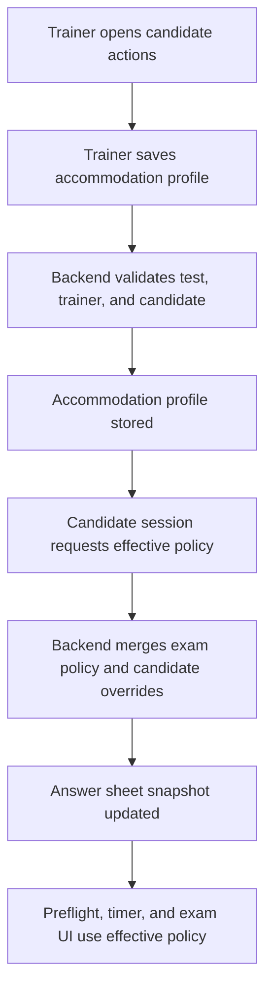
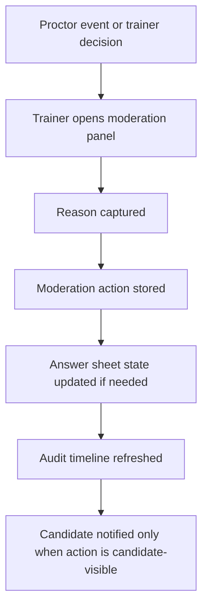
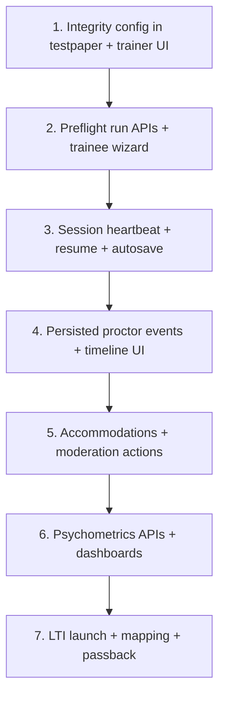
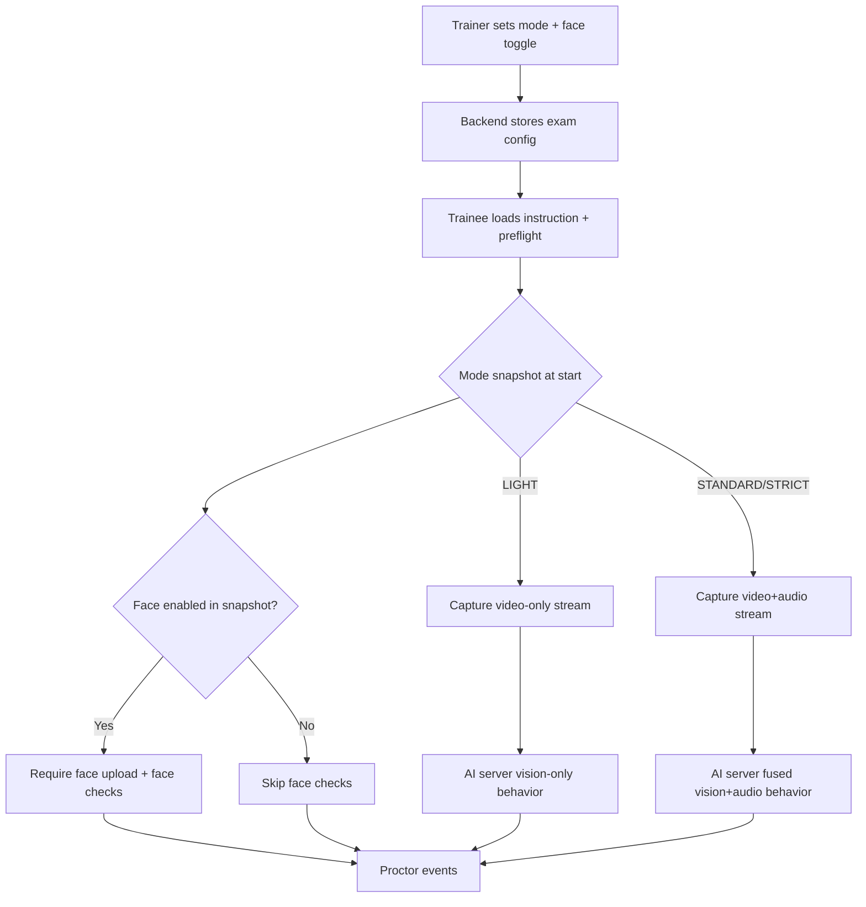
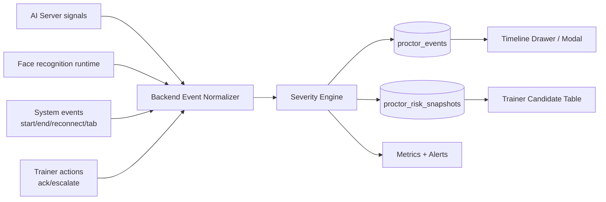
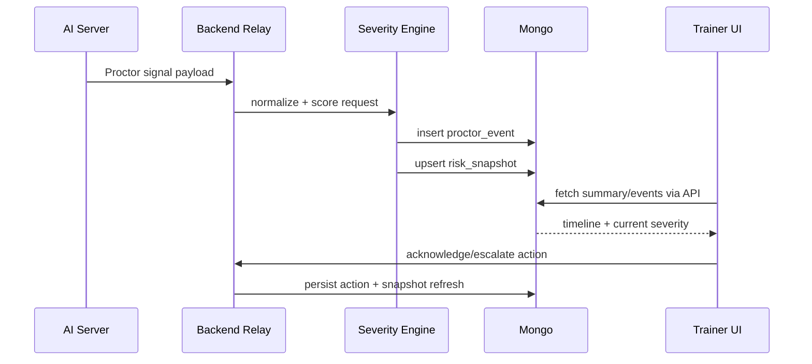

# Detailed Implementation Overview

This document translates the current roadmap items into implementation-level plans for this repository.

Scope:

1. Integrity modes + preflight wizard
2. Event timeline + severity scoring in Live Exam Operations
3. Session resilience (reconnect/grace/auto-save)
4. Psychometric dashboards
5. Accommodations/moderation
6. LTI integration

The plan is intentionally concrete: schema changes, backend and frontend file touchpoints, API contracts, rollout order, and validation criteria.

---

## Why These Sections Matter

Before implementation details, here is the business and product reason for each section:

1. Integrity modes + preflight wizard
- Why needed: not every exam needs the same strictness level. This gives controlled flexibility (light vs strict) and prevents candidates from entering with broken camera/mic/setup, reducing exam disruption and integrity disputes.

2. Event timeline + severity scoring in Live Exam Operations
- Why needed: live alerts are currently hard to audit after the moment passes. A timeline with severity scores gives trainers evidence, context, and consistent decisions instead of guesswork.

3. Session resilience (reconnect/grace/auto-save)
- Why needed: network drops and refreshes happen in real exams. Without resilience, candidates lose answers, trainers get false alarms, and support load increases. This protects fairness and continuity.

4. Psychometric dashboards
- Why needed: score-only reporting does not show exam quality. Psychometric metrics help identify weak or unfair questions, improve question banks over time, and increase trust in exam outcomes.

5. Accommodations/moderation
- Why needed: production exam systems must support accessibility and documented human intervention. This ensures fairness for different learner needs and creates a traceable moderation trail.

6. LTI integration
- Why needed: institutions usually run exams through LMS platforms. LTI enables secure LMS launch and grade passback, which is required for enterprise adoption and smoother instructor workflows.

---

## 0. Current Baseline (What Exists Today)

### Existing backend building blocks

- Exam lifecycle flags and state validation:
  - `Backend/schemas/testpaper.js`
  - `Backend/services/examStateMachine.js`
  - `Backend/services/testpaper.js`
  - `Backend/services/registrationlink.js`
- Trainee registration/exam entry:
  - `Backend/routes/trainee.js`
  - `Backend/services/trainee.js`
  - `Backend/schemas/traineeenter.js`
  - `Backend/schemas/answersheet.js`
- Result generation:
  - `Backend/services/generateResults.js`
  - `Backend/services/excel.js`
  - `Backend/schemas/results.js`
  - `Backend/schemas/subResults.js`
- Real-time channels:
  - `Backend/wsServer.js` (signaling relay)
  - `Backend/resultServer.js` (result relay)
  - `Backend/services/relay/*`
- Observability primitives already present:
  - `Backend/services/logger.js`
  - `Backend/services/metrics.js`
  - `Backend/services/alerts.js`

### Existing frontend building blocks

- API contracts and network wrappers:
  - `Frontend/src/services/Apis.js`
  - `Frontend/src/services/axiosCall.js`
- Trainee flow:
  - `Frontend/src/components/trainee/register/traineeregister.js`
  - `Frontend/src/components/trainee/examPortal/instruction.js`
  - `Frontend/src/components/trainee/examPortal/portal.js`
  - `Frontend/src/components/trainee/examPortal/singleQuestion.js`
  - `Frontend/src/components/trainee/FaceRecognition.js`
  - `Frontend/src/services/traineeSession.js`
- Trainer live operations:
  - `Frontend/src/components/trainer/conducttest/*`
  - `Frontend/src/components/trainer/TrainerLivePreview.js`
  - `Frontend/src/components/trainer/TrainerResultPreview.js`
- Dashboard/charts stack:
  - `Frontend/src/components/dashboard/welcome.js`
  - `chart.js` + `react-chartjs-2` already installed

### High-level gap summary

- There is no persisted proctor event timeline yet (alerts are mostly live/ephemeral).
- Session resilience is partial (some reconnect logic, no formal heartbeat/grace state model).
- Psychometric analytics are limited to counts and feedback averages.
- Accommodations and moderation workflow are not represented as first-class domain entities.
- LTI integration does not exist.

---

## 1. Integrity Modes + Preflight Wizard

## 1.1 Objective

Provide explicit exam integrity profiles (for example: standard/strict/remote-lite), and enforce preflight checks before candidate entry.

This should allow:

- Trainer chooses integrity mode before exam starts.
- Candidate must pass required checks (camera/mic/network/device checks) per mode.
- Backend enforces entry gate (not only UI-level checks).

## 1.2 Data Model Changes

### A) Extend `testpaper` schema

File to change:

- `Backend/schemas/testpaper.js`

Add fields:

- `integrityMode` (String enum):
  - suggested enum values: `LIGHT`, `STANDARD`, `STRICT`
  - default: `STANDARD`
- `integrityPolicy` (Object, persisted snapshot of policy knobs):
  - `requireCamera` (Boolean)
  - `requireMicrophone` (Boolean)
  - `requireFullscreen` (Boolean)
  - `requireFaceVerification` (Boolean)
  - `allowTabSwitchTolerance` (Number)
  - `preflightMaxFailures` (Number)
- `preflightEnabled` (Boolean, default true)

### B) New collection: `preflight_runs`

Add files:

- `Backend/schemas/preflightRun.js` (new)
- `Backend/models/preflightRun.js` (new)

Suggested schema:

- `testid` (ObjectId -> `TestPaperModel`)
- `traineeid` (ObjectId -> `TraineeEnterModel`)
- `attemptNo` (Number)
- `mode` (String enum copied from `integrityMode`)
- `status` (enum: `PENDING`, `PASSED`, `FAILED`, `EXPIRED`)
- `startedAt`, `completedAt`
- `checks` (array of check records):
  - `checkType` (for example `camera`, `microphone`, `network`, `face_reference`)
  - `passed` (Boolean)
  - `value` (Mixed/String)
  - `reason` (String)
  - `timestamp` (Date)
- `clientMeta`:
  - `userAgent`, `platform`, `screenWidth`, `screenHeight`, `timezone`

Indexes:

- `{ testid: 1, traineeid: 1, createdAt: -1 }`
- `{ status: 1, createdAt: -1 }`

### C) Optional resilience linkage

If combining with section 3:

- Add `activePreflightRunId` in `answersheet` (`Backend/schemas/answersheet.js`)

## 1.3 Backend Changes

### A) Add policy endpoints

Files:

- `Backend/routes/testpaper.js`
- `Backend/services/testpaper.js`
- `Backend/services/examStateMachine.js`

New endpoints:

- `POST /api/v1/test/integrity/config`
  - input: `{ id, integrityMode, integrityPolicy, preflightEnabled }`
  - guard: only `TRAINER`, only before `START_EXAM`
- `POST /api/v1/test/integrity/details`
  - input: `{ id }`
  - output: integrity configuration for trainer UI

State-machine enforcement:

- Add new action in `ExamActions`:
  - `CONFIG_INTEGRITY_POLICY`
- In `canApplyAction`, only permit in `SCHEDULED` state.

### B) Add preflight endpoints

Files:

- `Backend/routes/trainee.js`
- `Backend/services/trainee.js`
- `Backend/services/preflight.js` (new)

New endpoints:

- `POST /api/v1/trainee/preflight/start`
  - creates `preflight_run` with `PENDING`
- `POST /api/v1/trainee/preflight/check`
  - appends individual check status
- `POST /api/v1/trainee/preflight/complete`
  - computes pass/fail and marks run
- `POST /api/v1/trainee/preflight/latest`
  - returns latest run status for resume

### C) Enforce preflight in exam entry

Files:

- `Backend/services/trainee.js` (`Answersheet` flow)

Before creating answer sheet:

- Load exam policy from `testpaper`.
- If `preflightEnabled === true`, require latest run status `PASSED`.
- Reject with clear reason if not passed.

## 1.4 Frontend Changes

### A) Trainer controls (integrity mode setup)

Files:

- `Frontend/src/components/trainer/newtest/basicForm.js`
- `Frontend/src/components/trainer/conducttest/details.js`
- `Frontend/src/services/Apis.js`

Add UI:

- Integrity mode selector in exam creation/edit and live control details.
- Policy read-only summary in Conduct Test page.

### B) Trainee preflight wizard

Files:

- `Frontend/src/components/trainee/examPortal/portal.js`
- `Frontend/src/components/trainee/examPortal/instruction.js`
- `Frontend/src/components/trainee/FaceRecognition.js`
- `Frontend/src/actions/traineeAction.js`
- `Frontend/src/reducers/trainee.js`
- New files:
  - `Frontend/src/components/trainee/examPortal/preflightWizard.js`
  - `Frontend/src/components/trainee/examPortal/preflightWizard.css`

Behavior:

- After instruction page and before `ProceedtoTest`, launch wizard.
- Wizard executes checks required by backend policy.
- Submit each check to backend and finalize with `preflight/complete`.
- Only allow entry on pass.

## 1.5 API Contract Additions

Add to `Frontend/src/services/Apis.js`:

- `SET_TEST_INTEGRITY_CONFIG`
- `GET_TEST_INTEGRITY_CONFIG`
- `TRAINEE_PREFLIGHT_START`
- `TRAINEE_PREFLIGHT_CHECK`
- `TRAINEE_PREFLIGHT_COMPLETE`
- `TRAINEE_PREFLIGHT_LATEST`

## 1.6 Acceptance Criteria

- Trainer can set mode/policy only before exam start.
- Candidate cannot start exam without passing required checks.
- Preflight failures are persisted and visible in backend logs.
- Reload/rejoin preserves preflight pass state.

## 1.7 Key Risks

- Browser permission inconsistencies.
- False negatives for face-based preflight.
- Tight coupling with FaceRecognition initialization.

Mitigation:

- Keep checks modular and soft-fail where policy allows.
- Separate "camera available" from "face match" checks.
- Add explicit error codes and remediation tips.

---

## 2. Event Timeline + Severity Scoring in Live Exam Operations

## 2.1 Objective

Replace ephemeral "live signal" behavior with a persistent proctor event timeline and severity scoring per candidate.

Target outcomes:

- Every proctoring signal is persisted with timestamp and source.
- Trainer sees trend + latest risk state + event drill-down.
- Alerts are interpretable and auditable.

## 2.2 Data Model Changes

### A) New collection: `proctor_events`

Add files:

- `Backend/schemas/proctorEvent.js` (new)
- `Backend/models/proctorEvent.js` (new)

Suggested schema:

- `testid` (ObjectId)
- `traineeid` (ObjectId)
- `sessionId` (String, example `testid:traineeid`)
- `source` (enum: `AI`, `FACE`, `WEBSOCKET`, `SYSTEM`, `MANUAL`)
- `eventType` (enum examples):
  - `NO_FACE`
  - `MULTI_FACE`
  - `FACE_MISMATCH`
  - `TAB_SWITCH`
  - `NETWORK_DROP`
  - `AUDIO_SUSPICIOUS`
  - `CHEATING_CONFIRMED`
  - `EXAM_FINISHED`
- `severityLevel` (enum: `LOW`, `MEDIUM`, `HIGH`, `CRITICAL`)
- `severityScore` (0-100)
- `confidence` (0-1)
- `payload` (Mixed) for model metadata
- `createdAt`

Indexes:

- `{ testid: 1, traineeid: 1, createdAt: -1 }`
- `{ sessionId: 1, createdAt: -1 }`
- `{ severityLevel: 1, createdAt: -1 }`

### B) Optional summary cache collection: `proctor_risk_snapshots`

Add files:

- `Backend/schemas/proctorRiskSnapshot.js` (new)
- `Backend/models/proctorRiskSnapshot.js` (new)

Purpose:

- Fast candidate list rendering without scanning full event timeline every poll.

## 2.3 Backend Changes

### A) Persist events from real-time channel

Files:

- `Backend/services/relay/createRelayServer.js`
- `Backend/services/relay/relayRouter.js` (no major change needed unless tagging)
- `Backend/services/proctorEvent.js` (new)
- `Backend/services/proctorSeverity.js` (new)

Flow:

1. Result relay receives messages (currently in websocket route path).
2. Parse structured payload `{ type, behaviour, ... }`.
3. Normalize to domain event.
4. Score severity via rule engine.
5. Persist to `proctor_events`.
6. Update snapshot cache.

### B) Add event APIs for trainer pages

Files:

- `Backend/routes/testpaper.js`
- `Backend/services/testpaper.js` or dedicated `Backend/services/proctoring.js` (recommended new)

Endpoints:

- `POST /api/v1/test/proctor/events`
  - filter by `testid`, `traineeid`, `from`, `to`, `severity`, pagination
- `POST /api/v1/test/proctor/summary`
  - returns current severity status per trainee
- `POST /api/v1/test/proctor/event/ack`
  - trainer can acknowledge/escalate a specific event

### C) Ensure finish events always emitted

Files:

- `Backend/services/trainee.js` (`EndTest`, timeout path in `flags`/answer update flow)
- `Backend/services/testpaper.js` (`endTest`)

Requirement:

- Emit `EXAM_FINISHED` event whether exam ends by user submit, trainer force-end, or timeout.

## 2.4 Frontend Changes

### A) Candidate table risk chips + timeline drawer

Files:

- `Frontend/src/components/trainer/conducttest/candidates.js`
- `Frontend/src/components/trainer/TrainerResultPreview.js`
- New file:
  - `Frontend/src/components/trainer/conducttest/proctorTimeline.js`

Behavior:

- Candidate row shows latest risk state from summary endpoint.
- Clicking alert opens timeline modal/drawer with chronological events.
- Add filters (All, Medium+, Critical only, last 5m, last 30m, full exam).

### B) API constants

File:

- `Frontend/src/services/Apis.js`

Add:

- `GET_PROCTOR_EVENTS`
- `GET_PROCTOR_SUMMARY`
- `ACK_PROCTOR_EVENT`

## 2.5 Severity Scoring Rules (Initial)

Example starter rules:

- `NO_FACE`:
  - short (<10s): 30
  - medium (10-30s): 55
  - long (>30s): 80
- `MULTI_FACE`: 70
- `FACE_MISMATCH` repeated 3x: 85
- `AUDIO_SUSPICIOUS` repeated >5/min: 65
- `CHEATING_CONFIRMED`: 95
- `EXAM_FINISHED`: informational (5)

Escalation:

- Multiple medium events within rolling window can elevate to high.

## 2.6 Acceptance Criteria

- Trainer can view ordered timeline for any candidate.
- Candidate list shows stable color states: normal/suspicious/cheating/finished.
- Events survive page refresh and server restarts.
- Timeout-based exam finish produces final event.

---

## 3. Session Resilience (Reconnect/Grace/Auto-save)

## 3.1 Objective

Ensure candidate exam continuity through transient network/browser issues while preserving exam integrity.

Target outcomes:

- Auto-save answers periodically and on navigation changes.
- Server-authoritative timing with reconnect grace policy.
- Candidate can rejoin safely without losing answer state.

## 3.2 Data Model Changes

### A) Extend `answersheet`

File:

- `Backend/schemas/answersheet.js`

Add fields:

- `lastHeartbeatAt` (Date)
- `lastClientSyncAt` (Date)
- `disconnectCount` (Number, default 0)
- `graceWindowUntil` (Date)
- `completionReason` (enum: `SUBMITTED`, `TIMEOUT`, `FORCED_BY_TRAINER`, `AUTO_TERMINATED`)
- `sessionVersion` (Number)
- `lastSavedQuestionIndex` (Number)

Indexes:

- `{ testid: 1, userid: 1 }` unique if not already enforced logically
- `{ completed: 1, lastHeartbeatAt: 1 }`

### B) Optional `answer_events` collection

For forensic replay:

- question changes with sequence number and timestamp.

## 3.3 Backend Changes

### A) Heartbeat/resume APIs

Files:

- `Backend/routes/trainee.js`
- `Backend/services/trainee.js`

Add endpoints:

- `POST /api/v1/trainee/session/heartbeat`
- `POST /api/v1/trainee/session/resume`
- `POST /api/v1/trainee/answers/batch-save`

### B) Idempotent answer updates

File:

- `Backend/services/trainee.js` (`UpdateAnswers`)

Enhancement:

- Include client `saveVersion` in payload.
- Reject stale updates (out-of-order) or merge deterministically.
- Return canonical answer state after save.

### C) Server authority for timeout

Files:

- `Backend/services/trainee.js` (`flags`, `UpdateAnswers`, `EndTest`)
- `Backend/services/testpaper.js` (`endTest`)

Behavior:

- Timeout computed from server timestamps only.
- On timeout: mark completed, set `completionReason=TIMEOUT`, emit finish event.

### D) Relay reconnect tuning

Files:

- `Backend/services/relay/createRelayServer.js`

Enhancements:

- Record reconnect metrics per session.
- Optionally add session-level "last seen" for trainer status fidelity.

## 3.4 Frontend Changes

### A) Auto-save and reconnect manager

Files:

- `Frontend/src/services/traineeSession.js`
- `Frontend/src/components/trainee/TraineeSessionManager.js`
- `Frontend/src/components/trainee/examPortal/singleQuestion.js`
- `Frontend/src/actions/traineeAction.js`
- `Frontend/src/reducers/trainee.js`

Implementation:

- Add periodic auto-save interval (for example every 10-15 seconds).
- Save on question navigation and before unload.
- On reconnect/resume:
  - request server answer sheet
  - reconcile unsynced local cache
  - restore active question index

### B) Offline UX

Files:

- `Frontend/src/components/trainee/examPortal/portal.js`
- `Frontend/src/components/trainee/examPortal/portal.css`

Add:

- "Reconnecting..." banner
- "Offline changes pending" indicator

## 3.5 API Contract Additions

File:

- `Frontend/src/services/Apis.js`

Add:

- `TRAINEE_SESSION_HEARTBEAT`
- `TRAINEE_SESSION_RESUME`
- `TRAINEE_BATCH_SAVE_ANSWERS`

## 3.6 Acceptance Criteria

- Candidate can recover from network drop and continue exam within grace window.
- No answer loss after refresh or temporary disconnect.
- Timeout ending is consistent and auditable.
- Trainer sees candidate status transitions accurately.

---

## 4. Psychometric Dashboards

## 4.1 Objective

Add exam-quality analytics beyond raw score:

- item difficulty
- item discrimination
- distractor quality
- score distribution and reliability indicators

This improves question bank quality and exam fairness.

## 4.2 Data Model Changes

### A) Extend per-question result detail

File:

- `Backend/schemas/subResults.js`

Add fields:

- `timeSpentSeconds` (Number, optional now; required for richer analytics later)
- `selectedOptionIds` (ObjectId array)
- `isSkipped` (Boolean)

### B) New collection: `psychometric_metrics`

Add files:

- `Backend/schemas/psychometricMetric.js` (new)
- `Backend/models/psychometricMetric.js` (new)

Fields:

- `testid`
- `computedAt`
- `sampleSize`
- `scoreDistribution` (bins/counts)
- `questionMetrics[]`:
  - `questionid`
  - `difficultyIndex` (p-value)
  - `discriminationIndex`
  - `pointBiserial` (optional)
  - `optionSelectionRates[]`
  - `flagLowQuality` (Boolean)

Indexes:

- `{ testid: 1, computedAt: -1 }`

## 4.3 Backend Changes

### A) Metric computation pipeline

Files:

- `Backend/services/generateResults.js`
- New:
  - `Backend/services/psychometrics.js`
  - `Backend/services/psychometricAggregation.js`

Flow:

1. After exam completion/result generation, compute psychometrics from `results`, `subResults`, `questions`.
2. Persist into `psychometric_metrics`.
3. Expose via API.

### B) API endpoints

Files:

- `Backend/routes/testpaper.js`
- `Backend/services/testpaper.js` or new `Backend/services/psychometrics.js`

Endpoints:

- `POST /api/v1/test/psychometrics/overview`
- `POST /api/v1/test/psychometrics/questions`
- `POST /api/v1/test/psychometrics/export`

### C) Dashboard API expansion

File:

- `Backend/services/Dashboard.js`

Add trainer-level insights:

- average exam difficulty trend
- question bank quality score
- frequently failing objectives/topics

## 4.4 Frontend Changes

Files:

- `Frontend/src/components/trainer/testdetails/stats.js`
- `Frontend/src/components/dashboard/welcome.js`
- `Frontend/src/services/Apis.js`

Add:

- New psychometric chart panels in test details.
- Drill-down table per question (difficulty/discrimination/distractor stats).
- Dashboard summary cards linking to low-quality items.

## 4.5 Acceptance Criteria

- Trainer can identify problematic questions after each exam.
- Psychometric charts render for completed exams only.
- Metrics are reproducible from source results.

---

## 5. Accommodations + Moderation

## 5.1 Why Needed

Production-grade exam systems need two separate but related capabilities:

1. **Accommodations**
   These make the exam fair and accessible for candidates with approved needs. Examples include extra time, larger text, high-contrast UI, screen-reader allowance, and candidate-level integrity exceptions where policy permits.

2. **Moderation**
   These give trainers controlled human intervention tools when something unusual happens during or after the exam. Examples include adding a note, excusing a flagged incident, extending time, force-submitting a session, or marking a session for further review.

Without this layer, the platform has three production risks:

- fairness risk: approved candidate adjustments are handled informally or inconsistently
- operations risk: trainers have no structured way to intervene during live issues
- audit risk: overrides happen without a durable record of who changed what and why

The goal is to make every exception explicit, policy-driven, and fully auditable.

## 5.2 Product Scope

This section should be implemented as two coordinated features.

### A) Accommodations

Per-candidate, pre-approved changes to the candidate experience or enforcement policy.

Initial scope:

- extra time in minutes
- high-contrast mode
- larger text mode
- screen-reader allowance
- face verification exemption
- microphone exemption
- screen-share exemption
- fullscreen exemption
- alternate exam start window
- alternate exam end window
- trainer notes explaining the accommodation

### B) Moderation

Live or post-exam trainer actions recorded against a candidate and optionally linked to a proctoring event.

Initial scope:

- add note
- acknowledge event
- excuse event
- confirm concern
- warn candidate
- extend time
- reopen candidate session before final publication
- force submit
- disqualify / invalidate result
- clear previously raised concern with reason

## 5.3 Design Principles

The implementation should follow these rules.

1. **Candidate-specific, not global**
   An accommodation applies to one candidate in one exam unless explicitly modeled as reusable.

2. **Policy snapshot at runtime**
   When the candidate enters the exam, the backend should compute an effective policy snapshot and persist it to the active session. Runtime logic should use that snapshot, not repeatedly re-read mixed sources.

3. **No silent override**
   Every moderation action must capture actor, timestamp, reason, and the before/after state when applicable.

4. **Controlled mutability**
   Some settings can change only before exam start. Others can change during the exam. The rules must be explicit.

5. **Simple trainer UX**
   Trainers should not see low-level system language. Actions should use plain labels like `Give extra time` and `Excuse this alert`.

## 5.4 Data Model Plan

### A) Preferred accommodation storage

Create a dedicated collection instead of embedding everything directly into the trainee document.

New files:

- `Backend/schemas/accommodationProfile.js`
- `Backend/models/accommodationProfile.js`

Recommended schema:

- `testid`: ObjectId, required
- `traineeid`: ObjectId, required
- `createdBy`: ObjectId, required
- `updatedBy`: ObjectId, required
- `status`: `ACTIVE | REVOKED`
- `reason`: String, required
- `notes`: String, optional
- `timeAdjustments`:
  - `extraTimeMinutes`: Number, default `0`
  - `customStartAt`: Date, nullable
  - `customEndAt`: Date, nullable
- `uiAdjustments`:
  - `highContrastMode`: Boolean
  - `largeTextMode`: Boolean
  - `screenReaderAllowed`: Boolean
- `integrityOverrides`:
  - `faceVerificationExempt`: Boolean
  - `microphoneExempt`: Boolean
  - `screenShareExempt`: Boolean
  - `fullscreenExempt`: Boolean
- `effectiveFrom`: Date
- `effectiveUntil`: Date, nullable
- `createdAt`, `updatedAt`

Indexes:

- `{ testid: 1, traineeid: 1, status: 1 }`
- unique partial index for one active profile per candidate/exam:
  - `{ testid: 1, traineeid: 1, status: 1 }` where `status = ACTIVE`

Why this is preferred:

- cleaner governance than mutating `traineeenter`
- easier audit trail
- supports later approval workflow if needed

### B) Moderation action log

New files:

- `Backend/schemas/moderationAction.js`
- `Backend/models/moderationAction.js`

Recommended schema:

- `testid`: ObjectId, required
- `traineeid`: ObjectId, required
- `trainerid`: ObjectId, required
- `actionType`:
  - `NOTE`
  - `ACK_EVENT`
  - `EXCUSE_EVENT`
  - `CONFIRM_EVENT`
  - `WARN_CANDIDATE`
  - `EXTEND_TIME`
  - `FORCE_SUBMIT`
  - `REOPEN_SESSION`
  - `DISQUALIFY`
  - `CLEAR_CONCERN`
- `reason`: String, required
- `linkedEventId`: ObjectId, nullable
- `payload`: Mixed object for action-specific data
  - examples: `{ minutes: 10 }`, `{ oldStatus: 'FINISHED', newStatus: 'REOPENED' }`
- `beforeState`: Mixed object, optional
- `afterState`: Mixed object, optional
- `visibleToCandidate`: Boolean, default `false`
- `createdAt`

Indexes:

- `{ testid: 1, traineeid: 1, createdAt: -1 }`
- `{ linkedEventId: 1 }`

### C) Runtime snapshot on answer sheet

Extend `Backend/schemas/answersheet.js` with a session snapshot so runtime logic is deterministic.

Add:

- `effectiveDurationMinutes`
- `effectiveIntegrityPolicy`
  - `requireCamera`
  - `requireMicrophone`
  - `requireFullscreen`
  - `requireScreenShare`
  - `requireFaceVerification`
- `effectiveUiAdjustments`
  - `highContrastMode`
  - `largeTextMode`
  - `screenReaderAllowed`
- `moderationStatus`
  - `NORMAL`
  - `UNDER_REVIEW`
  - `WARNED`
  - `FORCE_SUBMITTED`
  - `DISQUALIFIED`
  - `REOPENED`
- `lastModerationActionAt`
- `grantedExtraTimeMinutes`

This snapshot should be written when the candidate session is initialized and updated only by allowed moderation actions.

### D) Result/report linkage

Extend the generated result/report path so moderation history is visible in exports.

Touchpoints:

- `Backend/schemas/results.js`
- `Backend/services/generateResults.js`
- `Backend/services/excel.js`

Add to result/report output:

- `moderationSummary`
- `finalDisposition`
- `accommodationSummary`

## 5.5 Backend Execution Plan

### A) New services

Create:

- `Backend/services/accommodations.js`
- `Backend/services/moderation.js`

Responsibilities:

`accommodations.js`

- validate trainer permission for candidate/test
- upsert active accommodation profile
- resolve effective policy for a candidate
- merge exam-level integrity policy with candidate-level overrides
- calculate effective duration and allowed windows

`moderation.js`

- validate allowed moderation action by session state
- persist moderation action log
- update answer sheet runtime snapshot where required
- emit timeline-style audit event for trainer UI
- optionally notify active candidate session over relay channel

### B) Route additions

Recommended endpoints:

Trainer-side accommodations:

- `POST /api/v1/test/candidate/accommodations/upsert`
- `POST /api/v1/test/candidate/accommodations/get`
- `POST /api/v1/test/candidate/accommodations/list`
- `POST /api/v1/test/candidate/accommodations/revoke`

Trainer-side moderation:

- `POST /api/v1/test/moderation/action`
- `POST /api/v1/test/moderation/history`
- `POST /api/v1/test/moderation/summary`

Candidate/runtime lookup:

- `POST /api/v1/trainee/session/effective-policy`

Suggested file touchpoints:

- `Backend/routes/testpaper.js`
- `Backend/routes/trainee.js`
- `Backend/services/testpaper.js`
- `Backend/services/trainee.js`
- `Backend/services/proctorTimeline.js`

### C) Runtime policy merge rules

The runtime policy should be computed as:

- base exam integrity mode/policy
- plus candidate accommodation overrides
- plus trainer moderation changes allowed during the exam

Examples:

- if exam requires microphone but candidate has `microphoneExempt = true`, effective session policy must set `requireMicrophone = false`
- if exam has face recognition enabled but candidate has `faceVerificationExempt = true`, FR initialization and related preflight checks must be skipped for that candidate only
- if extra time is granted, timer calculations must use `effectiveDurationMinutes`, not `test.duration`

### D) Session-state enforcement rules

Allowed mutations by state:

| Candidate state | Allowed accommodation changes | Allowed moderation changes |
|---|---|---|
| Before start | all | note, warn |
| In progress | time extension, UI adjustments, integrity exemptions only if policy allows | note, acknowledge, excuse, confirm, warn, extend time, force submit |
| Finished before publication | none | note, excuse, confirm, reopen session, disqualify |
| Published result | none | note only unless admin-grade override workflow is added later |

### E) Candidate communication behavior

Only candidate-visible moderation actions should surface in the trainee UI.

Examples:

- `WARN_CANDIDATE`: show in-session warning banner/modal
- `EXTEND_TIME`: show neutral notice like `Your exam time was updated`
- `FORCE_SUBMIT`: show final submission notice

Everything else remains internal to trainer/reporting by default.

## 5.6 Frontend Execution Plan

### A) Trainer live operations UI

Touchpoints:

- `Frontend/src/components/trainer/conducttest/candidates.js`
- `Frontend/src/components/trainer/conducttest/details.js`
- `Frontend/src/components/trainer/conducttest/ProctorTimelineModal.js`

New components:

- `Frontend/src/components/trainer/conducttest/AccommodationEditor.js`
- `Frontend/src/components/trainer/conducttest/ModerationPanel.js`
- `Frontend/src/components/trainer/conducttest/ModerationHistoryDrawer.js`

Required UX:

- candidate row action: `Accommodations`
- candidate row action: `Moderate`
- moderation panel with mandatory reason field
- timeline that interleaves proctor events and moderation actions
- badges like `Extra time`, `Face check not required`, `Under review`

### B) Trainer exam details UI

Touchpoints:

- `Frontend/src/components/trainer/testdetails/trainee.js`
- `Frontend/src/components/trainer/testdetails/stats.js`

Add:

- accommodation summary column or subpanel
- moderation history access from student details
- final disposition line in result/details views

### C) Trainee UI changes

Touchpoints:

- `Frontend/src/components/trainee/examPortal/instruction.js`
- `Frontend/src/components/trainee/examPortal/preflightWizard.js`
- `Frontend/src/components/trainee/examPortal/portal.js`
- related CSS files in `Frontend/src/components/trainee/examPortal/`

Behavior:

- hide checks that are exempted for this candidate
- adjust labels so the candidate sees only what applies to them
- apply high-contrast / large-text classes from effective policy
- show updated timer if extra time is granted
- show candidate-facing moderation notice only for actions intended to be visible

### D) Copy and UX rules

Avoid internal terms in trainer-facing or candidate-facing text.

Examples:

- avoid: `faceVerificationExempt`
- use: `Face check not required`

- avoid: `moderation action logged`
- use: `Trainer note saved`

- avoid: `integrity override`
- use: `Exam requirement adjusted`

## 5.7 Reporting and Audit Plan

The moderation trail should be visible in three places.

1. live operations timeline
2. exam details / student audit history
3. exported result artifacts

Excel/result export additions:

- candidate accommodation summary
- moderation action count
- final disposition
- last trainer note / last moderation timestamp

This is important because a production review often happens after the session, not during it.

## 5.8 Mermaid Flows

### Accommodation resolution flow

### Moderation event flow

## 5.9 Rollout Phases

### Phase 5.1 Foundation

- create `accommodation_profiles`
- create `moderation_actions`
- extend `answersheet` runtime snapshot
- add backend resolution helpers

### Phase 5.2 Runtime support

- candidate effective policy endpoint
- timer extension support
- preflight conditional checks based on candidate profile
- face recognition / mic / screen-share exemptions per candidate

### Phase 5.3 Trainer tools

- accommodation editor UI
- moderation panel UI
- moderation history timeline integration

### Phase 5.4 Reporting

- moderation summary in result details
- moderation/accommodation info in Excel/export

## 5.10 Test Plan

### Backend tests

- active accommodation upsert per candidate/test
- invalid trainer cannot modify another trainer?s candidate
- extra time changes effective duration correctly
- candidate-level FR exemption disables only FR-related checks
- force submit writes moderation action and updates answer sheet state
- reopened session requires explicit trainer reason and allowed state

### Frontend tests

- trainer can open/save accommodations
- trainer cannot submit moderation without reason
- trainee instruction/preflight hides exempted checks
- timer updates when extra time is granted during exam
- moderation history renders in candidate audit views

### End-to-end tests

- candidate with extra time receives longer timer than base exam duration
- candidate with face-check exemption enters exam without FR flow
- trainer warns candidate during live exam and candidate sees visible warning
- trainer force submits candidate and session closes correctly
- exam export includes accommodation and moderation summary

## 5.11 Acceptance Criteria

- one active accommodation profile exists per candidate per exam
- effective policy is deterministic and stored with the session
- candidate-facing checks respect accommodations consistently
- moderation actions require reason and actor identity
- trainer moderation history is visible in live operations and exam details
- exports include moderation/accommodation summaries
- no hidden or silent runtime override exists without an audit record

---

## 6. LTI Integration

## 6.1 Objective

Enable LMS launch and grade passback so exams can run from LMS platforms (Canvas/Moodle/Blackboard) with secure identity/context mapping.

## 6.2 Data Model Changes

### A) Platform configuration

Add files:

- `Backend/schemas/ltiPlatform.js` (new)
- `Backend/models/ltiPlatform.js` (new)

Fields:

- `platformName`
- `issuer`
- `clientId`
- `authLoginUrl`
- `authTokenUrl`
- `jwksUrl`
- `deploymentId`
- `active`

### B) LTI launch/session mappings

Add files:

- `Backend/schemas/ltiLaunch.js` (new)
- `Backend/models/ltiLaunch.js` (new)

Fields:

- `platformId`
- `resourceLinkId`
- `contextId`
- `ltiUserId`
- `email`
- `roles`
- `mappedLocalUserId` / `mappedTraineeId`
- `testid`
- `lineItemUrl` (for AGS passback)
- `nonce`, `state`, `expiresAt`

Indexes:

- `{ platformId: 1, resourceLinkId: 1, ltiUserId: 1 }`
- `{ state: 1 }`

## 6.3 Backend Changes

### A) New LTI module

Add folder:

- `Backend/services/lti/`

Suggested files:

- `oidcLogin.js`
- `launchValidator.js`
- `jwksCache.js`
- `roleMapper.js`
- `agsClient.js`
- `deepLinking.js`

### B) New routes

Add files:

- `Backend/routes/lti.js` (new)
- mount in `Backend/app.js`

Endpoints:

- `POST /api/v1/lti/login` (OIDC login initiation)
- `POST /api/v1/lti/launch` (id_token validation and local session mapping)
- `POST /api/v1/lti/deep-link` (optional)
- `POST /api/v1/lti/grade/passback` (service endpoint or async worker trigger)

### C) Grade passback integration

Files:

- `Backend/services/generateResults.js`
- `Backend/services/excel.js` (optional export link in report)
- New optional worker:
  - `Backend/services/lti/gradeDispatch.js`

Behavior:

- After result generation for LTI-linked attempts, send score to LMS AGS endpoint.
- Store passback status/retry state.

## 6.4 Frontend Changes

Minimal candidate UI changes:

- likely none for normal LTI launch if backend handles redirect and session bootstrap.

Trainer/admin UI additions:

- platform configuration screens:
  - `Frontend/src/components/admin/*` (new LTI settings page)
- map LMS resource link to local exam:
  - `Frontend/src/components/trainer/alltests/*` or dedicated mapping modal

API constants:

- `Frontend/src/services/Apis.js` add LTI admin endpoints.

## 6.5 Security Requirements

- Strict JWT signature validation against platform JWKS.
- Nonce/state replay protection.
- Clock-skew tolerance and token expiry enforcement.
- Platform-scoped config separation.
- Audit logs for launch and passback failures.

## 6.6 Acceptance Criteria

- LMS launch creates/links correct local candidate context.
- Candidate enters correct exam without manual ID input.
- Final score is returned to LMS for linked attempts.

---

## 7. Cross-Cutting Infrastructure Work

These are shared requirements across all six sections.

### A) Environment and config additions

Files:

- `.env.docker.example`
- `Backend/config/custom-environment-variables.json`
- `Backend/config/default.json`
- `docker-compose.yml`

Add variables:

- Integrity/preflight:
  - `PREFLIGHT_ENABLED_DEFAULT`
  - `PREFLIGHT_MAX_ATTEMPTS`
- Proctor events:
  - `PROCTOR_EVENT_RETENTION_DAYS`
  - `PROCTOR_SEVERITY_PROFILE`
- Resilience:
  - `SESSION_HEARTBEAT_INTERVAL_MS`
  - `SESSION_GRACE_WINDOW_SECONDS`
  - `AUTOSAVE_INTERVAL_SECONDS`
- LTI:
  - `LTI_ENABLED`
  - `LTI_JWKS_CACHE_TTL_SECONDS`
  - `LTI_STATE_TTL_SECONDS`

### B) Validation and contract hardening

Add request validators for all new payloads:

- Keep current `validatorCompat` style or migrate endpoints to centralized schema validation middleware.

### C) Observability

Files:

- `Backend/services/logger.js`
- `Backend/services/metrics.js`
- `Backend/services/alerts.js`

Add metrics:

- preflight pass/fail counts
- reconnect rate and resume success rate
- proctor event ingestion throughput and error rate
- LTI launch/passback success rates

---

## 8. Suggested Delivery Order (Low-Risk Sequence)

Rationale:

- Start with integrity and entry gating before advanced analytics.
- Add resilience before escalating live-monitoring complexity.
- Implement LTI after core workflows are stable and observable.

---

## 9. Testing Strategy by Section

### Integrity + preflight

- Unit:
  - policy validation by exam state
  - preflight pass/fail evaluator
- Integration:
  - trainee cannot start exam without required pass
- E2E:
  - strict mode flow (expected blocks)
  - light mode flow (allowed path)

### Event timeline + severity

- Unit:
  - scoring rules and escalation windows
- Integration:
  - websocket result message persists in DB and appears in summary API
- E2E:
  - simulated events reflected in trainer table + timeline modal

### Session resilience

- Integration:
  - reconnect within grace resumes session
  - timeout without heartbeat auto-completes
- E2E:
  - browser refresh mid-exam retains answers

### Psychometrics

- Unit:
  - metric formulas from deterministic fixture dataset
- Integration:
  - completed exam generates psychometric docs

### Accommodations/moderation

- Integration:
  - extra time honored in pending timer
  - moderation actions persisted and retrievable

### LTI

- Integration:
  - launch token validation, mapping, grade passback
- E2E (staging):
  - LMS launch -> attempt -> completion -> grade visible in LMS

---

## 10. Definition of Done (Global)

Each roadmap section is considered done only when all are true:

- schema migration applied and indexed
- endpoints implemented and documented
- frontend integrated with no hardcoded contracts
- tests added (unit + integration at minimum)
- observability metrics and error logs added
- Docker runbook updated in `docs/DOCKER_SETUP.md`
- no regression in existing admin/trainer/trainee flows

---

## 11. Open Design Decisions to Finalize Before Build

1. Integrity mode taxonomy:
   - fixed modes only vs fixed + custom policy overrides
2. Proctor severity ownership:
   - rules-only vs model confidence weighted scoring
3. Grace policy:
   - strict global rule vs per-exam configurable
4. Psychometric scope:
   - classical test theory first only, or add IRT later
5. LTI coverage:
   - LTI 1.3 launch only first, or launch + AGS + deep-link in same phase

---

## 12. Practical First Sprint Cut (If You Start This Week)

If implementation starts immediately, this is the safest first sprint:

- Add `integrityMode` + `integrityPolicy` to `testpaper` schema and APIs.
- Implement minimal preflight run collection with `camera/mic/face-reference` checks.
- Enforce preflight pass in `trainee.Answersheet`.
- Add persisted `proctor_events` with only 4 event types:
  - `NORMAL`, `SUSPICIOUS`, `CHEATING`, `EXAM_FINISHED`
- Add trainer timeline modal in candidate table.

This gives visible product value quickly and creates the data foundation for the remaining roadmap items.

---

## 13. Execution Plan: Integrity Modes + AI Channel Gating + Face Toggle Override

### Why this is needed

This change is required to make integrity modes truly meaningful and predictable in production:

- `LIGHT` should reduce friction and run safely without microphone dependency.
- `STANDARD` and `STRICT` should use both vision + audio monitoring by default.
- Face verification should remain configurable per exam session, but only before start.
- The runtime should never enforce checks or models that are intentionally disabled by policy/toggle.

Without this, mode selection is mostly cosmetic and creates hidden failures (for example, mic-off candidates still blocked or AI expecting audio that is not being sent).

### Target behavior (single source of truth)

| Mode | AI model channels | Preflight requirements | VPN/Proxy check | Face toggle default | Face toggle editable | In-exam face requirement |
|---|---|---|---|---|---|---|
| `LIGHT` | Vision only (`head/gaze/lip`) | Camera required, mic optional, fullscreen optional | Required check, warn/log by default | `OFF` | Before start only | `OFF` unless trainer explicitly enables before start |
| `STANDARD` | Vision + Audio | Camera required, mic required, fullscreen optional | Required check, block by default (allow override policy) | `ON` | Before start only | Depends on toggle at start snapshot |
| `STRICT` | Vision + Audio | Camera required, mic required, fullscreen required | Required check, hard-block by default | `ON` | Before start only | Depends on toggle at start snapshot |

Face-toggle override rule:

- If trainer turns face toggle `OFF` before exam start, face upload/verification/in-exam face checks are skipped for that session, even in `STANDARD` or `STRICT`.
- Once exam starts, toggle is locked for session consistency.

### High-level architecture adjustment

### Implementation plan (by layer)

#### 13.1 Data model and config snapshot

Goal: lock monitoring behavior at exam-start so rules do not drift mid-session.

Backend files:

- `Backend/schemas/testpaper.js`
- `Backend/services/testpaper.js`
- `Backend/services/trainee.js`
- `Backend/services/integrityPolicy.js`
- `Backend/schemas/answersheet.js` (add snapshot field)

Changes:

- Keep canonical fields on test:
  - `integrityMode`
  - `integrityPolicy`
  - `faceRecognitionEnabled`
  - `preflightEnabled`
- Add `sessionPolicySnapshot` to answersheet at trainee start:
  - `integrityMode`
  - `requireCamera`
  - `requireMicrophone`
  - `requireFullscreen`
  - `requireFaceVerification`
  - `vpnCheckEnabled`
  - `vpnAction` (`allow` | `warn` | `block`)
  - `faceRecognitionEnabled`
  - `aiChannelMode`: `vision_only` | `vision_audio`
- Snapshot is created in `trainee.Answersheet` and used for all later checks/events for that attempt.

#### 13.2 Policy resolver and defaults

Goal: mode-driven defaults with explicit face override behavior.

Backend files:

- `Backend/services/integrityPolicy.js`
- `Backend/services/testpaper.js`

Changes:

- Add deterministic resolver:
  - `resolveRuntimePolicy({ mode, integrityPolicy, faceRecognitionEnabled })`
- Enforce defaults:
  - `LIGHT`: `requireMicrophone=false`, `requireFaceVerification=false`, `aiChannelMode=vision_only`, `faceRecognitionEnabled=false`, `vpnCheckEnabled=true`, `vpnAction=warn` by default.
  - `STANDARD`: `requireMicrophone=true`, `aiChannelMode=vision_audio`, `faceRecognitionEnabled=true`, `vpnCheckEnabled=true`, `vpnAction=block` by default.
  - `STRICT`: `requireMicrophone=true`, `aiChannelMode=vision_audio`, `faceRecognitionEnabled=true`, `vpnCheckEnabled=true`, `vpnAction=block` by default.
- Face override:
  - Trainer may set `faceRecognitionEnabled=false` pre-start.
  - Runtime resolver sets `requireFaceVerification=false` when face toggle is false.

#### 13.3 Trainer APIs and guardrails

Goal: allow pre-start configuration only; lock after start.

Backend files:

- `Backend/routes/testpaper.js`
- `Backend/services/testpaper.js`
- `Backend/services/examStateMachine.js`

Changes:

- Extend integrity config response payload to include computed runtime summary:
  - `aiChannelMode`
  - `effectiveRequireFaceVerification`
- Keep update action pre-start only (`CONFIG_INTEGRITY_POLICY` guard already present).
- If exam already started, reject face-toggle changes with clear message.

#### 13.4 Trainee preflight and permission handling

Goal: preflight should check only what is required for active mode/toggle.

Frontend files:

- `Frontend/src/components/trainee/examPortal/instruction.js`
- `Frontend/src/components/trainee/examPortal/preflightWizard.js`
- `Frontend/src/reducers/trainee.js`

Changes:

- Replace one shared `permissionGranted` flag with granular checks:
  - `cameraGranted`
  - `microphoneGranted`
- Permission request should be policy-aware:
  - `LIGHT`: request video only by default.
  - `STANDARD|STRICT`: request video + audio.
- Preflight checks:
  - microphone check runs only when `requireMicrophone=true`.
  - face-reference check runs only when `faceRecognitionEnabled=true`.
  - VPN/proxy check is always executed when `vpnCheckEnabled=true`.
- UI copy should show effective requirements derived from runtime policy, not static text.

#### 13.5 Media capture and WebRTC channel gating

Goal: send only needed tracks and keep transport stable.

Frontend files:

- `Frontend/src/components/trainee/TraineeStreamSender.js`
- `Frontend/src/components/trainee/WebRTCServer.js`
- `Frontend/src/components/trainee/examPortal/portal.js`

Changes:

- Build media constraints from runtime snapshot:
  - `vision_only` -> `{ video: true, audio: false }`
  - `vision_audio` -> `{ video: true, audio: true }`
- Include in AI `/offer` payload:
  - `mode`
  - `aiChannelMode`
  - `faceRecognitionEnabled`
- Ensure reconnection uses same channel mode (from snapshot).

#### 13.6 AI server behavior routing

Goal: avoid false errors when no audio track exists; produce meaningful output in both modes.

AI server files:

- `AI Server/server.py`
- `AI Server/models/audio.py` (no functional change needed unless thresholds updated)

Changes:

- Parse `aiChannelMode` from `/offer` request.
- If `vision_only`:
  - do not expect or require audio track.
  - compute behavior from vision pipeline only.
  - annotate outgoing behavior payload with `source: "vision_only"`.
- If `vision_audio`:
  - keep fused logic.
  - annotate with `source: "vision_audio"`.
- Add fallback status when audio track drops unexpectedly in `vision_audio`:
  - emit temporary `source: "vision_degraded"` and warning event, then continue.

#### 13.7 Face registration and runtime checks alignment

Goal: only require face image/checks when face is enabled for that exam session.

Frontend files:

- `Frontend/src/components/trainee/register/traineeregister.js`
- `Frontend/src/components/trainee/examPortal/instruction.js`
- `Frontend/src/components/trainee/FaceRecognition.js`

Backend files:

- `Backend/services/trainee.js`

Changes:

- Registration form:
  - show face upload only when `faceRecognitionEnabled=true`.
  - skip face image validation/upload when off.
- Instruction page:
  - show face-related instruction line only when face toggle is on.
- Runtime face detection:
  - mount `FaceRecognition` component only when `faceRecognitionEnabled=true` in effective exam state.

#### 13.8 Alerts and examiner experience

Goal: trainer sees honest state based on active channel mode.

Frontend files:

- `Frontend/src/components/trainer/TrainerResultPreview.js`
- `Frontend/src/components/trainer/conducttest/candidates.js`

Backend files:

- Result relay path (existing ws relay, no schema migration needed if payload is passthrough)

Changes:

- Extend live status payload with:
  - `source` (`vision_only` | `vision_audio` | `vision_degraded`)
  - `mode` (`LIGHT|STANDARD|STRICT`)
  - `vpnStatus` (`clear` | `suspected_vpn` | `unknown`)
- Trainer UI badges:
  - show current monitoring source beside severity badge.
  - prevent confusion when LIGHT runs without audio.

#### 13.9 VPN/Proxy detection implementation

Goal: reliably evaluate VPN/proxy risk during preflight for `LIGHT`, `STANDARD`, and `STRICT`.

Important constraint:

- Browser alone cannot reliably detect VPN usage.
- Detection must be backend-side using candidate public IP + IP intelligence provider.

Backend files:

- `Backend/services/preflight.js`
- `Backend/services/trainee.js`
- `Backend/services/integrityPolicy.js`
- `Backend/services/logger.js`
- `Backend/services/metrics.js`
- `Backend/config/default.json`
- `Backend/config/custom-environment-variables.json`

New service:

- `Backend/services/networkRisk.js`
  - Input: request IP (`x-forwarded-for` aware), user agent, optional ASN/org data.
  - Output:
    - `status`: `clear` | `suspected_vpn` | `unknown`
    - `confidence`: `low` | `medium` | `high`
    - `provider`: source of lookup
    - `reasonCodes`: array (e.g., `DATACENTER_IP`, `ANON_PROXY`, `TOR_EXIT`)

Policy behavior:

- `LIGHT`:
  - Check runs and result is recorded.
  - Default action is `warn` (candidate can continue; trainer sees risk marker).
- `STANDARD`:
  - Default action is `block` unless trainer/org policy explicitly allows warn-only.
- `STRICT`:
  - Default action is `block` (no bypass from candidate side).

Preflight check object:

- add new check type: `vpn_proxy`
- reason examples:
  - `No VPN/proxy risk detected.`
  - `VPN/proxy risk detected (datacenter/anonymizer IP).`
  - `Risk service unavailable; result unknown.`

Failure handling:

- if risk service is down:
  - `LIGHT`: continue with `unknown` + warning.
  - `STANDARD`: policy-controlled (`warn` by default in outage mode only, configurable).
  - `STRICT`: block by default unless explicit emergency override env flag is enabled.

### API contract updates

`POST /api/v1/test/integrity/config` response add:

- `runtimePolicy.aiChannelMode`
- `runtimePolicy.requireFaceVerification`
- `runtimePolicy.vpnCheckEnabled`
- `runtimePolicy.vpnAction`

`POST {AI_SERVER_URL}/offer` request add:

- `mode`
- `aiChannelMode`
- `faceRecognitionEnabled`

AI result websocket payload add:

- `source`
- `mode`

Preflight responses add:

- `vpnStatus`
- `vpnConfidence`
- `vpnReasonCodes`

### Edge cases to handle explicitly

1. Candidate denies microphone in `STANDARD/STRICT`:
   - preflight fails with actionable message.
2. Candidate denies microphone in `LIGHT`:
   - no fail (unless admin custom policy requires mic).
3. Trainer toggles face off before start in `STRICT`:
   - face checks skipped, no blocking popups.
4. Mid-exam reconnect:
   - must restore same `sessionPolicySnapshot`.
5. Old exams created before this change:
   - backfill defaults via resolver (no hard migration required for first pass).
6. Candidate behind corporate NAT or campus network:
   - avoid false-positive hard blocks via allowlist (`ASN/CIDR`) and confidence thresholding.
7. VPN intelligence provider outage:
   - follow mode-specific fallback policy and emit operational alert.

### Test plan for this implementation block

Unit tests:

- policy resolver matrix (`mode + face toggle -> effective runtime policy`)
- snapshot builder correctness
- AI routing decision (`vision_only` vs `vision_audio`)

Integration tests:

- preflight passes in `LIGHT` with camera-only permission
- preflight blocks in `STANDARD/STRICT` when mic denied
- face-toggle off pre-start disables face requirement in standard/strict
- answersheet stores immutable snapshot
- vpn/proxy flagged IP triggers expected mode action (`warn` for light, `block` for standard/strict by default)

E2E smoke tests:

1. Create exam in `LIGHT`, start exam, verify no mic prompt needed, monitoring still active.
2. Create exam in `STANDARD`, keep default face on, verify face flow + audio flow.
3. Create exam in `STRICT`, toggle face off before start, verify no face blocking during exam.
4. Reconnect mid-exam and confirm channel mode remains unchanged.
5. Run with VPN/proxy-enabled network and verify mode-specific preflight behavior.

### Delivery sequence (safe execution order)

1. Backend policy resolver + runtime summary contract.
2. Trainer config UI alignment and pre-start lock behavior.
3. Trainee preflight permission split (`cameraGranted/microphoneGranted`).
4. Media/WebRTC conditional track sending.
5. AI server channel-mode routing.
6. Face registration/instruction/runtime alignment.
7. Alert payload + trainer badge enhancements.
8. VPN/proxy detection backend integration + preflight UI.
9. Full regression and docker validation.

### Definition of done for this section

- Mode behavior exactly matches the target matrix above.
- `LIGHT` runs stable with video-only pipeline.
- `STANDARD/STRICT` require mic unless custom policy disables it.
- Face toggle works pre-start and is hard-locked after start.
- Trainee not blocked by disabled checks.
- Trainer UI clearly indicates monitoring source and severity.
- VPN/proxy risk is evaluated in all modes and enforced per mode policy.
- Automated tests and Docker smoke runs pass.

---

## 14. Execution Plan: Event Timeline + Severity Scoring in Live Exam Operations

### Why this is needed

Current live monitoring is mostly real-time and moment-based. Once a signal passes, it is hard for trainers to audit what happened, when it happened, and how serious it was.

This implementation gives:

- persistent evidence per candidate session
- consistent severity scoring instead of subjective interpretation
- clear incident timeline for post-exam review
- better operational trust when disputes happen

### 14.1 Target product behavior

For each candidate in a running exam:

- Trainer sees a live severity badge (`Normal`, `Suspicious`, `High Risk`, `Cheating`, `Finished`).
- Trainer can open a timeline panel and view every event in chronological order.
- Each event shows:
  - time
  - source (AI / face / system / trainer action)
  - human-readable message
  - severity score
  - confidence
- Timeline supports filters:
  - severity level
  - event type
  - last 5m / 15m / 30m / full session
- Trainer can acknowledge/escalate events.
- Exam completion is always recorded as a timeline event (manual submit, trainer end, timeout end).

Candidate-facing behavior:

- no raw technical identifiers shown to trainees
- no exposure of internal scoring formulas

### 14.2 Architecture and event flow

### 14.3 Domain model and severity framework

#### Event taxonomy (first production set)

- Identity/face:
  - `NO_FACE`
  - `MULTI_FACE`
  - `FACE_MISMATCH`
- Behavior:
  - `LOOKING_AWAY`
  - `TAB_SWITCH`
  - `FULLSCREEN_EXIT`
- Audio:
  - `AUDIO_SUSPICIOUS`
  - `AUDIO_MULTIPLE_VOICES`
- Session/system:
  - `NETWORK_DROP`
  - `RECONNECTED`
  - `EXAM_STARTED`
  - `EXAM_FINISHED`
- Trainer actions:
  - `TRAINER_ACK`
  - `TRAINER_ESCALATE`

#### Severity score model (v1)

Per event:

`eventScore = clamp(baseScore * sourceWeight * confidenceWeight * repeatMultiplier, 0, 100)`

Rolling risk score per candidate:

`rollingRisk = max(latestCritical, weightedWindowAverage(last N minutes) - decayFactor)`

Severity bands:

- `0-24`: `NORMAL`
- `25-49`: `SUSPICIOUS`
- `50-74`: `HIGH_RISK`
- `75-100`: `CHEATING`
- exam ended flag sets display state to `FINISHED` regardless of risk band

Starter base scores:

- `NO_FACE`: 35
- `MULTI_FACE`: 70
- `FACE_MISMATCH`: 75
- `LOOKING_AWAY`: 25
- `TAB_SWITCH`: 45
- `FULLSCREEN_EXIT`: 60
- `AUDIO_SUSPICIOUS`: 40
- `AUDIO_MULTIPLE_VOICES`: 65
- `NETWORK_DROP`: 20
- `RECONNECTED`: 10
- `EXAM_STARTED`: 5
- `EXAM_FINISHED`: 5

Escalation rules:

- 3x `TAB_SWITCH` in 2 minutes: force minimum `HIGH_RISK`
- 2x `MULTI_FACE` in 3 minutes: force `CHEATING`
- `FACE_MISMATCH` + `AUDIO_MULTIPLE_VOICES` inside 60s: force `CHEATING`
- decay: lower rolling score gradually if no suspicious events in last 5 minutes

### 14.4 Database and schema implementation

#### A) `proctor_events` (append-only)

Files to add:

- `Backend/schemas/proctorEvent.js`
- `Backend/models/proctorEvent.js`

Schema fields:

- `testid` (ObjectId, required, indexed)
- `traineeid` (ObjectId, required, indexed)
- `sessionId` (String, required, indexed)
- `eventId` (String UUID, unique)
- `eventType` (String enum)
- `source` (String enum: `AI`, `FACE`, `SYSTEM`, `TRAINER`)
- `severityScore` (Number 0-100)
- `severityLevel` (String enum)
- `confidence` (Number 0-1)
- `message` (String, human-readable)
- `payload` (Mixed, model metadata, no sensitive media blobs)
- `createdAt` (Date, indexed)
- `dedupeKey` (String, indexed, optional)
- `acked` (Boolean, default false)
- `ackedBy` (ObjectId nullable)
- `ackedAt` (Date nullable)

Indexes:

- `{ testid: 1, traineeid: 1, createdAt: -1 }`
- `{ sessionId: 1, createdAt: -1 }`
- `{ severityLevel: 1, createdAt: -1 }`
- `{ dedupeKey: 1, createdAt: -1 }`

Retention:

- optional TTL strategy for old events (for example 90 days) after organizational approval

#### B) `proctor_risk_snapshots` (fast read model)

Files to add:

- `Backend/schemas/proctorRiskSnapshot.js`
- `Backend/models/proctorRiskSnapshot.js`

Schema fields:

- `testid`
- `traineeid`
- `sessionId`
- `rollingRiskScore`
- `severityLevel`
- `lastEventType`
- `lastEventAt`
- `suspiciousCount`
- `highRiskCount`
- `criticalCount`
- `isFinished`
- `updatedAt`

Purpose:

- candidate list should query this snapshot collection, not scan entire event history

#### C) Optional audit table for trainer actions

If strict audit is required, add:

- `Backend/schemas/proctorEventAction.js`
- `Backend/models/proctorEventAction.js`

to store acknowledge/escalate notes separately.

### 14.5 Backend service and route changes

#### New backend services

- `Backend/services/proctorEventNormalizer.js`
  - converts mixed inbound payloads into canonical event shape
- `Backend/services/proctorSeverityEngine.js`
  - computes eventScore and rollingRisk
  - applies escalation and decay windows
- `Backend/services/proctorTimeline.js`
  - persistence and query orchestration
- `Backend/services/proctorRiskSnapshot.js`
  - upsert/update snapshot read model

#### Existing backend files to update

- `Backend/services/relay/createRelayServer.js`
  - intercept result messages and call timeline ingest service
- `Backend/services/relay/relayRouter.js`
  - ensure route path labels and metadata are forwarded
- `Backend/services/trainee.js`
  - emit finish events from all end paths
- `Backend/services/testpaper.js`
  - emit finish/system events on trainer-driven ends
- `Backend/services/examStateMachine.js`
  - emit transition events where needed (`STARTED`, `ENDED`, `TIMEOUT`)
- `Backend/services/logger.js`
  - structured logging fields: `sessionId`, `eventType`, `severityLevel`
- `Backend/services/metrics.js`
  - counters/gauges for event throughput and severity distribution
- `Backend/services/alerts.js`
  - optional alert fanout on critical clusters

#### Routes and endpoints

Update/add in:

- `Backend/routes/testpaper.js`

Endpoints:

- `POST /api/v1/test/proctor/events`
  - filters: `testid`, `traineeid`, `from`, `to`, `severity`, `eventType`, `page`, `limit`
- `POST /api/v1/test/proctor/summary`
  - returns snapshot list for candidate table
- `POST /api/v1/test/proctor/event/ack`
  - acknowledge event with optional note
- `POST /api/v1/test/proctor/event/escalate`
  - manual severity override with audit note

Response contract requirements:

- return user-friendly `message` strings
- never return internal error identifiers directly to UI

### 14.6 AI server contract alignment

Files likely touched:

- `AI/server.py`
- any websocket emit helper used by AI inference loop

Payload contract from AI to backend relay must include:

- `testid`
- `traineeid`
- `sessionId`
- `timestamp`
- `signalType` (`vision` | `audio`)
- `eventType`
- `confidence`
- `rawScore` (optional)
- `meta` (model version, frame/audio window info)

Normalization rule:

- backend remains source of truth for final severity score
- AI sends signal confidence and classification only

### 14.7 Frontend (trainer) implementation plan

Primary files:

- `Frontend/src/components/trainer/conducttest/candidates.js`
- `Frontend/src/components/trainer/TrainerResultPreview.js`
- `Frontend/src/components/trainer/conducttest/conducttes.css`
- `Frontend/src/services/Apis.js`
- `Frontend/src/services/axiosCall.js`

New files:

- `Frontend/src/components/trainer/conducttest/ProctorTimelineDrawer.js`
- `Frontend/src/components/trainer/conducttest/SeverityBadge.js`
- `Frontend/src/components/trainer/conducttest/TimelineFilters.js`

UI behavior:

- candidate table shows:
  - status badge color by severity
  - numeric rolling score
  - time since last event
  - quick action to open timeline
- timeline panel:
  - grouped by timestamp
  - clear icon + label per event type
  - severity chip on each row
  - acknowledge button per event
- avoid technical wording:
  - use "Network reconnected" instead of internal tags
  - use "Face not visible" instead of `NO_FACE`

Color standard:

- `NORMAL`: green
- `SUSPICIOUS`: amber
- `HIGH_RISK`: orange/red
- `CHEATING`: red
- `FINISHED`: slate/neutral

### 14.8 Live exam operation behavior requirements

1. Timeline must continue if trainer refreshes page.
2. Candidate row status must update within polling interval (or socket push).
3. Acknowledged events stay acknowledged after reload.
4. Ended-by-timeout exams must emit `EXAM_FINISHED`.
5. If AI signal stream pauses, show stale indicator instead of false normal.

### 14.9 Sequence for implementation (safe order)

Execution phases:

1. Add schemas + models + indexes.
2. Build normalizer + severity engine with unit tests.
3. Integrate ingestion into relay/result pipeline.
4. Emit guaranteed finish/system events from all end paths.
5. Add summary/events/ack APIs.
6. Build trainer timeline UI + severity badges.
7. Wire metrics and critical alerting.
8. Full regression and cross-role validation.

### 14.10 Validation and test matrix

Unit tests:

- score mapping and escalation windows
- dedupe behavior
- decay behavior
- snapshot update idempotency

Integration tests:

- AI payload ingestion persists event + updates snapshot
- manual ack updates event state
- trainer end + timeout end emit `EXAM_FINISHED`
- summary endpoint matches timeline latest status

E2E tests:

1. Start exam -> generate normal events -> verify green status.
2. Trigger repeated suspicious behavior -> status moves to amber/red.
3. Open timeline -> verify ordered events and readable messages.
4. Acknowledge an event -> verify persisted ack state.
5. Let timer auto-end -> verify finished event appears.

### 14.11 Docker compose rule during implementation

For this section, after any code change in each service:

- backend-only changes:
  - `docker compose --env-file .env.docker up -d --build backend`
- frontend + backend changes:
  - `docker compose --env-file .env.docker up -d --build frontend backend`
- ai + backend (ingestion contract) changes:
  - `docker compose --env-file .env.docker up -d --build ai-server backend`
- all three changed:
  - `docker compose --env-file .env.docker up -d --build frontend backend ai-server`

### 14.12 Definition of done for this section

- Event timeline exists and is queryable for every candidate session.
- Severity score is deterministic from documented rules.
- Trainer can audit, acknowledge, and escalate with persistence.
- Candidate list reflects current severity accurately and quickly.
- Timeout/manual/submit end paths all produce final timeline event.
- Non-technical UX wording is used across trainer and trainee views.
- Metrics and alerts are available for ingestion/processing failures.
